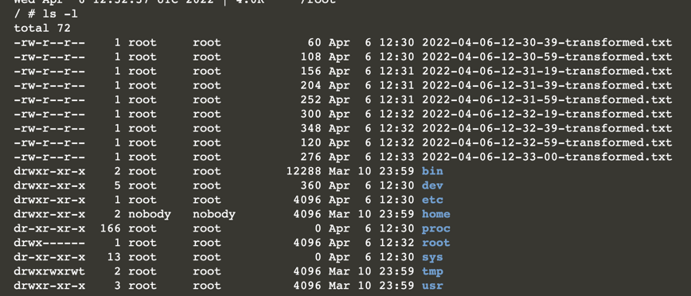

#  Implement the Adapter Pattern

A Sidecar container enhances the functionality of the main application container by enforcing the separation of concerns. 

The Adapter pattern is a specialized implementation of the Sidecar pattern. 

In this exercise, you will implement the Adapter pattern to provide a standardized view of the log output for a third-party logging service.

In this scenario, you will:

* Create a multi-container Pod.
* Create a volume and mount it to the main application container and the Sidecar container.
  See transformation logic in action.
  
## Creating a Pod with a Sidecar

The Adapter pattern helps with providing a simplified, homogenized view of an application running within a container.

For example, we could stand up another container that unifies the log output of the application container

As a result, other monitoring tools can rely on a standardized view of the log output without having to transform it into an expected format.

In this scenario, you will create a new Pod in a YAML file named adapter.yaml. 

The Pod declares two containers. 

The container app uses the image busybox and runs the following command.

```
while true; do echo "$(date) | $(du -sh ~)" >> /var/logs/diskspace.txt; sleep 5; done;
```
You can create the initial Pod setup with the following command.

```
kubectl run adapter --image=busybox --restart=Never -o yaml --dry-run -- /bin/sh -c 'while true; do echo "$(date) | $(du -sh ~)" >> /var/logs/diskspace.txt; sleep 5; done;' > adapter.yaml
```

```
apiVersion: v1
kind: Pod
metadata:
  creationTimestamp: null
  labels:
    run: adapter
  name: adapter
spec:
  containers:
  - args:
    - /bin/sh
    - -c
    - while true; do echo "$(date) | $(du -sh ~)" >> /var/logs/diskspace.txt; sleep
      5; done;
    image: busybox
    name: adapter
    resources: {}
  dnsPolicy: ClusterFirst
  restartPolicy: Never
status: {}
```

The Adapter container <b>transformer</b> should use the image <b>busybox</b> and run the following command to strip the log output of the date for later consumption by a monitoring tool.

```
sleep 20; while true; do while read LINE; do echo "$LINE" | cut -f2 -d"|" >> $(date +%Y-%m-%d-%H-%M-%S)-transformed.txt; done < /var/logs/diskspace.txt; sleep 20; done;
```

Be aware that the logic does not handle corner cases (e.g., automatically deleting old entries) and would look different in production systems.

Edit the generated YAML file and add the Adapter container.

## Sharing Data Across Multiple Containers

```
apiVersion: v1
kind: Pod
metadata:
  creationTimestamp: null
  name: adapter
spec:
  volumes:
    - name: config-volume
      emptyDir: {}
  containers:
  - args:
    - /bin/sh
    - -c
    - 'while true; do echo "$(date) | $(du -sh ~)" >> /var/logs/diskspace.txt; sleep 5; done;'
    image: busybox
    name: app
    volumeMounts:
      - name: config-volume
        mountPath: /var/logs
    resources: {}
  - image: busybox
    name: transformer
    args:
    - /bin/sh
    - -c
    - 'sleep 20; while true; do while read LINE; do echo "$LINE" | cut -f2 -d"|" >> $(date +%Y-%m-%d-%H-%M-%S)-transformed.txt; done < /var/logs/diskspace.txt; sleep 20; done;'
    volumeMounts:
      - name: config-volume
        mountPath: /var/logs
  dnsPolicy: ClusterFirst
  restartPolicy: Never
status: {}
```


## Transforming Log Output

You can now create the Pod declaratively by pointing it to the YAML file

During the creation of the Pod, you can follow the creation of individual containers.

```
kubectl get pods
```

Wait until the Pod arrives at the Running status. 

Once the application is running, shell into the main application container named transformer. 

The ready attribute will now render the value 2/2 to indicate that two out of two containers have started.

```
kubectl exec adapter --container=transformer -it -- /bin/sh

cat /var/logs/diskspace.txt
```

Have a look at the contents of the file /var/logs/diskspace.txt

It contains a timestamped entry per line indicating the disk space.

You should find a new text file in the current directory every 20 seconds. Each of the files contains the disk space without the date prefix in its contents. Looks like the Adapter container does its job properly.




