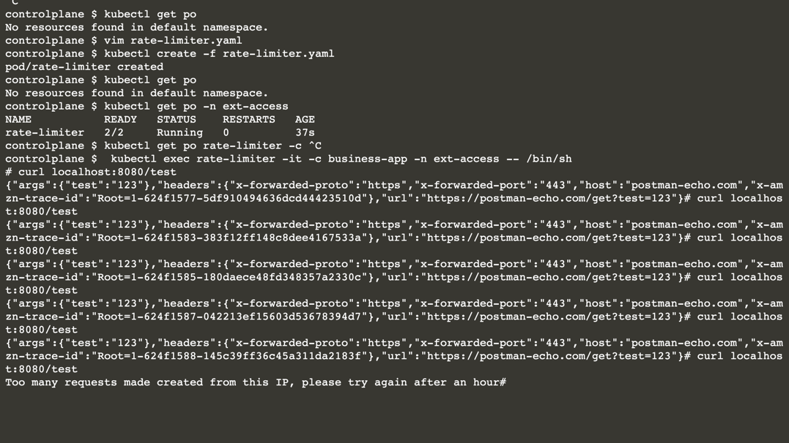

# Multi-Container: Implementing the Ambassador Pattern

* Creating a Pod manifest
* Adding an ambassador container to the Pod manifest
* Verifying the correct ambassador behavior in an interactive shell

## Creating the Pod manifest

you'll be asked to implement rate-limiting functionality for HTTP(S) calls to an external service. 

For example, the requirements for the rate limiter could say that an application can only make a maximum of five calls every 15 minutes. 

Instead of strongly coupling the rate-limiting logic to the application code, it will be provided by an ambassador container.

The image bmuschko/nodejs-business-app:1.0.0 represents a Node.js-based application that makes a call to localhost on port 8081. 

The ambassador container represented by the image bmuschko/nodejs-ambassador:1.0.0 running on port 8081 will take on making the HTTP call to the external service while at the same time enforcing rate limiting

The image bmuschko/nodejs-business-app:1.0.0 represents a Node.js-based application that makes a call to localhost on port 8081. The ambassador container represented by the image bmuschko/nodejs-ambassador:1.0.0 running on port 8081 will take on making the HTTP call to the external service while at the same time enforcing rate limiting.

```
kubectl run rate-limiter --image=bmuschko/nodejs-business-app:1.0.0 -n ext-access --restart=Never -o yaml --dry-run=client > rate-limiter.yaml


apiVersion: v1
kind: Pod
metadata:
  name: rate-limiter
  namespace: ext-access
spec:
  containers:
  - name: business-app
    image: bmuschko/nodejs-business-app:1.0.0
    ports:
    - containerPort: 8080
  restartPolicy: Never
```

## Adding an ambassador container

Modify the YAML manifest by adding the ambassador container named ambassador.

The ambassador container uses the image bmuschko/nodejs-ambassador:1.0.0 and exposes the container port 8081.

```
apiVersion: v1
kind: Pod
metadata:
  name: rate-limiter
  namespace: ext-access
spec:
  containers:
  - name: business-app
    image: bmuschko/nodejs-business-app:1.0.0
    ports:
    - containerPort: 8080
  - name: ambassador
    image: bmuschko/nodejs-ambassador:1.0.0
    ports:
    - containerPort: 8081
  restartPolicy: Never
```

## Verifying rating limiting

Execute the following command to create the Pod:

```
kubectl apply -f rate-limiter.yaml
```

Shell into the container named business-app. 

Execute the curl command at least six times. 

You should encounter the error message "Too many requests have been made from this IP, please try again after an hour" on the sixth call:

```
kubectl exec rate-limiter -it -c business-app -n ext-access -- /bin/sh
```


