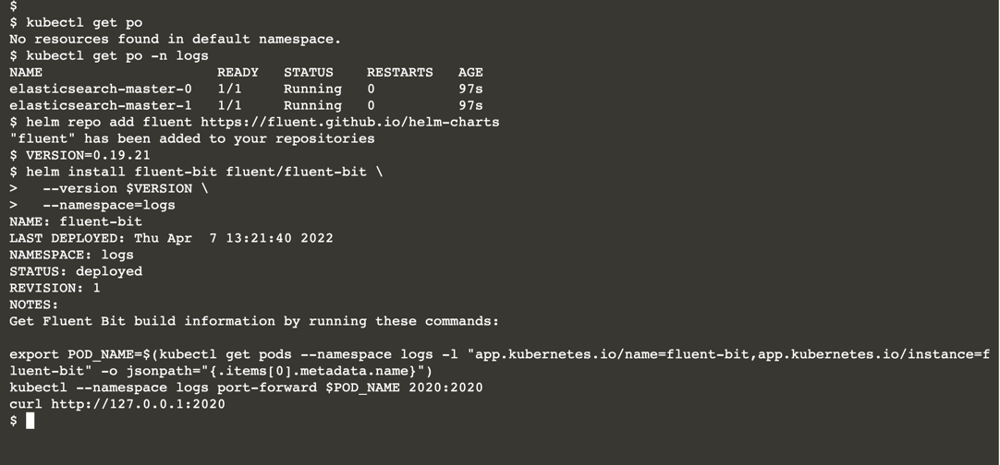

# Logging with EFK

This scenario takes you through the basics of deploying a logging solution for observing your applications on Kubernetes. 

The premise is all the log streams generated by the applications are aggregated into a central datastore. 

From that datastore, queries and filters produce views from the aggregated logs.

Applications in containers should only produce logs as event streams and leave the aggregation and routing to other services on Kubernetes. 

This pattern is emphasized as factor 11 Logs of the The Twelve Factors App methodology.

Commonly the three components ElasticSearch, Fluentd, and Kibana (EFK) are combined for the stack

Sometimes stack use Fluent Bit instead of Fluentd. Fluent Bit is mostly functionally the same, but lighter in features and size.

Other solutions sometimes use Logstash (ELK) instead of Fluentd.

In the following steps you will learn:

* How to deploy ElasticSearch, Fluentd, and Kibana
* How to generate log events and query then in Kibana


Fluentd is an open source data collector, that lets you unify the data collection and consumption for better use and understanding of data.

In this stack Fluent Bit runs on each node (DaemonSet) and collects all the logs from /var/logs and routes them to ElasticSearch.

## Aggregation: ElasticSearch

Elasticsearch is a search engine based on the Lucene library. 

It provides a distributed, multitenant-capable full-text search engine with an HTTP web interface and schema-free JSON documents.

## Viewing: Kibana

Kibana is an open source data visualization plugin for Elasticsearch. 

It provides visualization capabilities on top of the content indexed on an Elasticsearch cluster. Users can create bar, line and scatter plots, or pie charts and maps on top of large volumes of data.

For Kubernetes, there are a wide variety of ways to assemble an EFK stack, especially with production or business-critical clusters. 

Some solutions may leverage an ElasticSearch service outside the cluster, perhaps offered by a cloud provider. For any solution that's deployed to Kubernetes, it's recommended to use Helm charts. 

Even with Helm charts there are a variety of solutions evolving and competing with each other.

However, this scenario is aimed to show how you can get a working stack up with reasonable ease so you can see how the components are installed and work with each other.

## Deploy ElasticSearch

Elasticsearch is a RESTful search engine based on the Lucene library.

It provides a distributed, multitenant-capable full-text search engine with an HTTP web interface and schema-free JSON documents. 

Elasticsearch is open source and developed in Java.

Create a namespace for the installation target:

```
kubectl create namespace logs
```

Add the chart repository for the Helm chart to be installed:

```
helm repo add elastic https://helm.elastic.co
```

Deploy the public Helm chart for ElasticSearch. The chart's default settings are appropriately opinionated for production deployment. Here, some of the default settings are downsized to fit in this scenario's cluster:

```
VERSION=7.17.1

helm install elasticsearch elastic/elasticsearch \
  --version=$VERSION \
  --namespace=logs \
  --set replicas=2 \
  --set resources.requests.memory="600Mi" \
  --set resources.limits.memory="600Mi" \
  -f elastic-values.yaml
```

```
elastic-values.yaml
# Permit co-located instances for solitary minikube virtual machines.
antiAffinity: "soft"

# Shrink default JVM heap.
esJavaOpts: "-Xmx128m -Xms128m"

# Allocate smaller chunks of memory per pod.
resources:
  requests:
    cpu: "100m"
    memory: "512M"
  limits:
    cpu: "1000m"
    memory: "512M"

persistence:
  enabled: false
```

## Deploy Fluent Bit

Fluent Bit is an open source specialized data collector. 

It provides built-in metrics and general purpose output interfaces for centralized collectors such as Fluentd. 

Create the configuration for Fluent Bit.

Install [Fluent Bit Helm Chart](https://artifacthub.io/packages/helm/fluent/fluent-bit) and pass the ElasticSearch service endpoint as a chart parameter.

Add the chart repository for the Helm chart to be installed:

```
helm repo add fluent https://fluent.github.io/helm-charts

VERSION=0.19.21

helm install fluent-bit fluent/fluent-bit \
  --version $VERSION \
  --namespace=logs
```




This chart will install a DaemonSet that will start a Fluent Bit Pod on each worker Node:

```
kubectl get pods,daemonset --namespace logs -o wide
```


With this, each Fluent Bit service will collect the logs from each Node and stream them to the ElasticSearch manager.

## Deploy Kibana

Kibana is a popular open-source user interface that lets you visualize your Elasticsearch data and navigate the Elastic Stack.

Do anything from tracking query load to understanding the way requests flow through your apps.

Install the [Kibana Helm Chart](httpshttps://artifacthub.io/packages/helm/elastic/kibana). The service will be accessible via a NodePort at 31000:

```aidl
VERSION=7.17.1

helm install kibana elastic/kibana \
  --version=$VERSION \
  --namespace=logs \
  --set service.type=NodePort \
  --set resources.requests.memory="1Gi" \
  --set resources.limits.memory="1Gi" \
  --set service.nodePort=31000
```


## Verify Running Stack

All three installations of ElasticSearch, Fluent Bit, and Kibana may be still initializing. 

To inspect the status of these deployments run this watch:

```
watch kubectl get deployments,pods,services --namespace=logs
```


Once complete, the Pods will move to the Running state. 

The full stack is not ready until all the Deployment statuses move to the Available (1) state.

While observing the progress, be patient, as it takes time for the stack to initialize, even with this small configuration.

## Generate Log Events

With a log observation stack in place, run this container to start generating random log events:

```
kubectl run random-logger --image=chentex/random-logger

kubectl logs pod/random-logger
```


* When Kibana appears for the first time there will be a brief animation while it initializes.
* On the Welcome page click Explore on my own.
* From the left-hand drop-down menu (≡) select the Discover item.
* Click on the button ⊕ Create index pattern.
* In the form field labeled Name enter logstash-*
* In the form field labeled Timestamp field, select @timestamp.
* From the bottom of the form click the button Create index pattern.
* In a moment a list of fields will appear.
* Again, from the left-hand drop-down menu (≡) select the Discover item.
* On the right is a listing of all the events. On the left, is a list of Available fields to choose for filtering.
* From the Available fields list, select and add the log field by clicking on the plus button (⊕). The events list now only sahows the log events.
* Chose an addtional filter from the from the Available fields list. Scrolling down and choose the _kubernetes.podname field. Click the plus button (⊕) button to the right of the label.
* The filter selection is added to the Selected fields list found on the top-left listing. Click on the filter and select the plus button (⊕) next to random-logger.
* Now only the log events from the random-logger appear.


