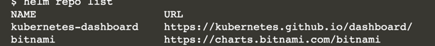
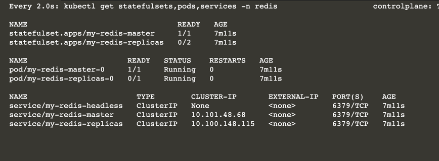

# Helm

Helm is the best way to find, share, and use software built for Kubernetes.

In the following steps you will learn:

* how to install and uninstall applications,
* what a chart provides,
* how to list public charts,
* how to list and add more repositories,
* how to create a custom chart,
* how to update a chart.

## Install Helm

Helm is a cluster administration tool that manages charts on Kubernetes.

Helm relies on a packaging format called charts. 

Charts define a composition of related Kubernetes resources and values that make up a deployment solution.

Charts are source code that can be packaged, named, versioned, and maintained in version control

The chart is a collection of Kubernetes manifests in the form of YAML files along with a templating language to allow contextual values to be injected into the YAMLs.

Charts complement your infrastructure-as-code (IaC) processes.

Helm also helps you manage the complexities of dependency management

Charts can include dependencies on other charts.

A chart is a deployable unit that can be inspected, listed, updated, and removed

The Helm CLI tool deploys charts to Kubernetes.

Interaction with Helm is through its command-line tool (CLI)

```
helm version --short
```

```
curl https://raw.githubusercontent.com/helm/helm/master/scripts/get-helm-3 | bash
```

The current local state of Helm is kept in your environment in the home location:


## Search For Redis Chart

Many common and publicly available open source projects can run on Kubernetes. 

Many of these projects offer containers that package these applications and vetted Helm charts for full production installations on Kubernetes.

Up until recently in 2020, all of the most commonly used public Helm charts were being lumped into a single Git repository for incubating and stable Helm charts.

This idea of centralizing all charts in GitHub has since been abandoned, thankfully. There are too many charts now being maintained by many different organizations and projects

### Artifact Hub

Now, the canonical source for cloud native artifacts, and specifically Helm charts, is [Artifact Hub](https://artifacthub.io/) an aggregator for distributed chart repos.

This hub has risen from the need for us to have a single place for us to search for charts.

While charts are listed here, the actual charts are hosted in a growing variety of repos

If you find a chart of interest the page for the specific chart will reveal the chart name, list of versions (semver.org format) and the repo where the chart can be found.

There are over 5400 charts available and growing each day:

```
helm search hub | wc -l

helm search hub clair

helm search hub redis

helm search hub redis | grep bitnami 
```

[Redis by bitNami](https://artifacthub.io/packages/helm/bitnami/redis)

### Repos

While the chart is listed in ARtifact Hub, the Bitnami organization has a public repo of all its charts

In each Hub chart page a repo is listed for you to add for access the chart

The instructions for the Redis chart says to add the bitnami repo

```
helm repo add bitnami https://charts.bitnami.com/bitnami
```


```
helm repo list
```



Instead of searching the Hub for charts you can also search the Bitnami repo:

```
helm search repo bitnami/redis
```


The Helm command can reveal additional information about the chart:

```
helm show chart bitnami/redis
helm show readme bitnami/redis
helm show values bitnami/redis
```


### Fabric8

```
helm search repo fabric8
helm repo add fabric8 https://fabric8.io/helm
```

## Deploy Redis

Create a namespace for the installation target:

```
kubectl create namespace redis
```

With a known chart name, use the install command to deploy the chart to your cluster:

```
redis-values.yaml
replica:
   replicaCount: 2

volumePermissions:
  enabled: true

securityContext:
  enabled: true
  fsGroup: 1001
  runAsUser: 1001
```

```
helm install my-redis bitnami/redis --version 14.3.3 --namespace redis --values redis-values.yaml
```

This will name a new install called my-redis and install a specific chart name and version into the redis namespace. 

The redis-values file override the chart's default values to ensure there are just 2 replicas and some file permission configuration is performed at startup. 

With the install command Helm launches the required Deployments, ReplicaSets, Pods, Services, ConfigMaps, or any other Kubernetes resource the chart defines.

Well written charts present notes as part of the installation instructions. 

The notes provide helpful information on how to access the new services. 

We'll follow these notes in the next step, but first, view all the installed charts:

```
helm list --all-namespaces

helm ls -n redis
```


### Chart Installation Information

For each chart deployed to the cluster its deployment information is maintained in a secret stored on the targeted Kubernetes cluster

This way multiple Helm clients can consistently list the installed charts on the cluster

The secrets are deployed to the namespace where the chart is deployed. The secret names have the sh.helm. prefix:


```
kubectl get secrets --all-namespaces | grep sh.helm

helm list -A

kubectl get secrets --all-namespaces --selector owner=helm

kubectl --namespace redis describe secret sh.helm.release.v1.my-redis.v1
```


## Observe Redis

Helm deploys all the chart defined Deployments, Pods, Services. 

The redis Pod remains in a pending state while the container image is downloaded and until a Persistent Volume is available. 

Once complete it moves into a running state.

Use the get command to find out what was deployed:

```
watch kubectl get statefulsets,pods,services -n redis
```

The Pod will be in a pending state while the Redis container image is downloaded and until a Persistent Volume is available. You will see a my-redis-master-0 and my-redis-replica-0 pod.


```
pv.yaml
kind: PersistentVolume
apiVersion: v1
metadata:
  name: pv-volume1
  labels:
    type: local
spec:
  capacity:
    storage: 10Gi
  accessModes:
    - ReadWriteOnce
  hostPath:
    path: "/mnt/data1"
---
kind: PersistentVolume
apiVersion: v1
metadata:
  name: pv-volume2
  labels:
    type: local
spec:
  capacity:
    storage: 10Gi
  accessModes:
    - ReadWriteOnce
  hostPath:
    path: "/mnt/data2"
---
kind: PersistentVolume
apiVersion: v1
metadata:
  name: pv-volume3
  labels:
    type: local
spec:
  capacity:
    storage: 10Gi
  accessModes:
    - ReadWriteOnce
  hostPath:
    path: "/mnt/data3"
```

and ensure Redis has permissions to write to these mount points:

```
kubectl apply -f pv.yaml
mkdir /mnt/data1 /mnt/data2 /mnt/data3 --mode=777
```




## Connect to Your Redis Server

To get your password query the Redis Secret:

```
export REDIS_PASSWORD=$(kubectl get secret --namespace redis my-redis -o jsonpath="{.data.redis-password}" | base64 --decode)
```

Expose the Redis service:

```
kubectl port-forward --namespace redis service/my-redis-master 6379:6379 > /dev/null &
redis-cli -h 127.0.0.1 -p 6379 -a $REDIS_PASSWORD ping
```

## Remove Redis

Now that Redis is running, take it back down. After all, these installations should not be precious snowflakes:

```
helm delete my-redis -n redis
```

No matter how complex the chart, the delete command will undo everything the install provisioned. 

The only thin left behind will be the namespace. Delete the namespace if you wish

```
kubectl delete namespace redis
```

## Explore Repositories

```
echo "The number of charts on Artifact Hub is: $(helm search hub | wc -l)."
```

The chart count is consistently increasing with the maturing Kubernetes ecosystem. There are numerous common charts that, as a Kubernetes developer, you may want to leverage

```
helm search hub postgres
helm search hub sonarqube
helm search hub rabbitmq
helm search hub kafka
helm search hub prometheus-operator
helm search hub tensorflow
helm search hub tekton
```

The source code for most charts is typically backed with a GitHub repo, a readme, and a team of people that are subject matter experts in forming these opinionated charts. As an example, take a look at the Minio chart source and scan the README to learn how this chart can be installed and configured. There will always be a section for installation and a section for the configuration that will tell you how to effectively install the chart for your specific target.

## Create Chart

Charts are helpful when creating your unique solutions. 

Application charts are often a combination on 3rd party public charts as well as your own. 

The first step is to create your new chart:

```
helm create app-chart

tree app-chart
```


All of your Kubernetes resource definitions in YAML files are located in the templates directory. 

Take a look at the top of <b>deployments.yaml</b>:

```
cat app-chart/templates/deployment.yaml | grep 'kind:' -n -B1 -A5
```


What about defining the container image for the deployment? That is an injected value as well:

```
cat app-chart/templates/deployment.yaml | grep 'image:' -n -C3
```


Notice the {{ .Values.image.repository }}, this is where the container name gets injected.

All of these values have defaults typically found in the values.yaml file in the chart directory:

```
cat app-chart/values.yaml | grep 'repository' -n -C3
```


Notice the templating key uses the dot ('.') notation to navigate and extract the values from the hierarchy in the values.yaml file.

In this case, the Helm create feature defaulted the deployed container to be the ubiquitous demonstration application nginx.

As is, this chart is ready to be deployed since all the defaults have been supplied.

A complete set of sensible defaults is a good practice for any chart you author. 

A good README for your chart should also have a table to reflect these defaults, options, and descriptions.

Before deploying to Kubernetes, the dry-run feature will list out the resources to the console. 

This allows you to inspect the injection of the values into the template without committing an installation, a helpful development technique. Observe how the container image name is injected into the template:

```
helm install my-app ./app-chart --dry-run --debug | grep 'image: "' -n -C3
```


Notice the ImagePullPolicy is set to the default of IfNotPreset. Before we deploy the chart we could modify the values.yaml file and change the policy value in there, but perhaps we would like to locally modify a different policy setting first to verify it works. Use the --set command to override a default value. Here we change the NGINX container image ImagePullPolicy from IfNotPreset to Always:

```
helm install my-app ./app-chart --dry-run --debug --set image.pullPolicy=Always | grep 'image: "' -n -C3
helm install my-app ./app-chart --set image.pullPolicy=Always
```

```aidl
helm list
kubectl get deployments,service
```

## Making your own chart repo

When you develop your charts, there are a few ways to add your charts to custom repositories, either publicly or privately. Some examples are:

* If your chart is in a GitHub account, the location can be registered to Helm so it can pull the chart from that source.

* A popular chart repo hosting service you can add to Kubernetes is called [ChartMuseum](https://github.com/helm/chartmuseum). Guess what, it also can be installed with a [ChartMuseum Helm chart](https://artifacthub.io/packages/helm/chartmuseum/chartmuseum). (ツ)

* You can also use GitHub pages to host an https://github.com/helm/chart-releaser

```
helm search hub chartmuseum
```

## Update Chart

Look at the service. Notice the service type is ClusterIP. 

To see the NGINX default page we would like to instead expose it as a NodePort. 

A kubectl patch could be applied, but it would be best to change the values.yaml file. 

Perhaps this is just to verify. We could simply change the installed application with a new value. 

Use the Helm upgrade command to modify the deployment:

```
helm upgrade my-app ./app-chart --install --reuse-values --set service.type=NodePort
```

Well, this demonstration chart is a bit deficient as it does not allow the values for the NodePort to be assigned. Right now it's a random value. We could modify the chart template to accept a nodePort value, but for this exercise apply this quick patch:

```
kubectl patch service my-app-app-chart --type='json' --patch='[{"op": "replace", "path": "/spec/ports/0/nodePort", "value":31111}]'
```

## Further commands

```
helm --help
helm lint
helm test
helm package
helm pull 
```
