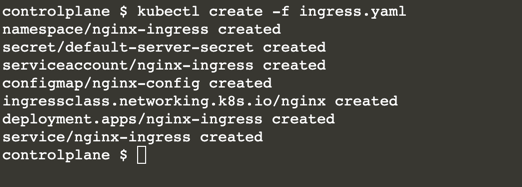

# Ingress Routing

Kubernetes have advanced networking capabilities that allow Pods and Services to communicate inside the cluster's network. An Ingress enables inbound connections to the cluster, allowing external traffic to reach the correct Pod.

Ingress enables externally-reachable urls, load balance traffic, terminate SSL, offer name based virtual hosting for a Kubernetes cluster.

In this scenario you will learn how to deploy and configure Ingress rules to manage incoming HTTP requests.

## Create Ingress Routing


### Step 1 - Create Deployment

To start, deploy an example HTTP server that will be the target of our requests. 

The deployment contains three deployments, one called webapp1 and a second called webapp2, and a third called webapp3 with a service for each.

```
apiVersion: apps/v1
kind: Deployment
metadata:
  name: webapp1
spec:
  replicas: 1
  selector:
    matchLabels:
      app: webapp1
  template:
    metadata:
      labels:
        app: webapp1
    spec:
      containers:
      - name: webapp1
        image: katacoda/docker-http-server:latest
        ports:
        - containerPort: 80
---
apiVersion: apps/v1
kind: Deployment
metadata:
  name: webapp2
spec:
  replicas: 1
  selector:
    matchLabels:
      app: webapp2
  template:
    metadata:
      labels:
        app: webapp2
    spec:
      containers:
      - name: webapp2
        image: katacoda/docker-http-server:latest
        ports:
        - containerPort: 80
---
apiVersion: apps/v1
kind: Deployment
metadata:
  name: webapp3
spec:
  replicas: 1
  selector:
    matchLabels:
      app: webapp3
  template:
    metadata:
      labels:
        app: webapp3
    spec:
      containers:
      - name: webapp3
        image: katacoda/docker-http-server:latest
        ports:
        - containerPort: 80
---
apiVersion: v1
kind: Service
metadata:
  name: webapp1-svc
  labels:
    app: webapp1
spec:
  ports:
  - port: 80
  selector:
    app: webapp1
---
apiVersion: v1
kind: Service
metadata:
  name: webapp2-svc
  labels:
    app: webapp2
spec:
  ports:
  - port: 80
  selector:
    app: webapp2
---
apiVersion: v1
kind: Service
metadata:
  name: webapp3-svc
  labels:
    app: webapp3
spec:
  ports:
  - port: 80
  selector:
    app: webapp3
```

```
kubectl apply -f deployment.yaml
kubectl get deployment
```

### Step 2 - Deploy Ingress

The YAML file ingress.yaml defines a Nginx-based Ingress controller together with a service making it available on Port 80 to external connections using ExternalIPs. 

If the Kubernetes cluster was running on a cloud provider then it would use a LoadBalancer service type.

The ServiceAccount defines the account with a set of permissions on how to access the cluster to access the defined Ingress Rules.

The default server secret is a self-signed certificate for other Nginx example SSL connections and is required by the Nginx Default Example.

```
apiVersion: v1
kind: Namespace
metadata:
  name: nginx-ingress
---
apiVersion: v1
kind: Secret
metadata:
  name: default-server-secret
  namespace: nginx-ingress
type: kubernetes.io/tls
data:
  tls.crt: LS0tLS1CRUdJTiBDRVJUSUZJQ0FURS0tLS0tCk1JSUN2akNDQWFZQ0NRREFPRjl0THNhWFhEQU5CZ2txaGtpRzl3MEJBUXNGQURBaE1SOHdIUVlEVlFRRERCWk8KUjBsT1dFbHVaM0psYzNORGIyNTBjbTlzYkdWeU1CNFhEVEU0TURreE1qRTRNRE16TlZvWERUSXpNRGt4TVRFNApNRE16TlZvd0lURWZNQjBHQTFVRUF3d1dUa2RKVGxoSmJtZHlaWE56UTI5dWRISnZiR3hsY2pDQ0FTSXdEUVlKCktvWklodmNOQVFFQkJRQURnZ0VQQURDQ0FRb0NnZ0VCQUwvN2hIUEtFWGRMdjNyaUM3QlBrMTNpWkt5eTlyQ08KR2xZUXYyK2EzUDF0azIrS3YwVGF5aGRCbDRrcnNUcTZzZm8vWUk1Y2Vhbkw4WGM3U1pyQkVRYm9EN2REbWs1Qgo4eDZLS2xHWU5IWlg0Rm5UZ0VPaStlM2ptTFFxRlBSY1kzVnNPazFFeUZBL0JnWlJVbkNHZUtGeERSN0tQdGhyCmtqSXVuektURXUyaDU4Tlp0S21ScUJHdDEwcTNRYzhZT3ExM2FnbmovUWRjc0ZYYTJnMjB1K1lYZDdoZ3krZksKWk4vVUkxQUQ0YzZyM1lma1ZWUmVHd1lxQVp1WXN2V0RKbW1GNWRwdEMzN011cDBPRUxVTExSakZJOTZXNXIwSAo1TmdPc25NWFJNV1hYVlpiNWRxT3R0SmRtS3FhZ25TZ1JQQVpQN2MwQjFQU2FqYzZjNGZRVXpNQ0F3RUFBVEFOCkJna3Foa2lHOXcwQkFRc0ZBQU9DQVFFQWpLb2tRdGRPcEsrTzhibWVPc3lySmdJSXJycVFVY2ZOUitjb0hZVUoKdGhrYnhITFMzR3VBTWI5dm15VExPY2xxeC9aYzJPblEwMEJCLzlTb0swcitFZ1U2UlVrRWtWcitTTFA3NTdUWgozZWI4dmdPdEduMS9ienM3bzNBaS9kclkrcUI5Q2k1S3lPc3FHTG1US2xFaUtOYkcyR1ZyTWxjS0ZYQU80YTY3Cklnc1hzYktNbTQwV1U3cG9mcGltU1ZmaXFSdkV5YmN3N0NYODF6cFErUyt1eHRYK2VBZ3V0NHh3VlI5d2IyVXYKelhuZk9HbWhWNThDd1dIQnNKa0kxNXhaa2VUWXdSN0diaEFMSkZUUkk3dkhvQXprTWIzbjAxQjQyWjNrN3RXNQpJUDFmTlpIOFUvOWxiUHNoT21FRFZkdjF5ZytVRVJxbStGSis2R0oxeFJGcGZnPT0KLS0tLS1FTkQgQ0VSVElGSUNBVEUtLS0tLQo=
  tls.key: LS0tLS1CRUdJTiBSU0EgUFJJVkFURSBLRVktLS0tLQpNSUlFcEFJQkFBS0NBUUVBdi91RWM4b1JkMHUvZXVJTHNFK1RYZUprckxMMnNJNGFWaEMvYjVyYy9XMlRiNHEvClJOcktGMEdYaVN1eE9ycXgrajlnamx4NXFjdnhkenRKbXNFUkJ1Z1B0ME9hVGtIekhvb3FVWmcwZGxmZ1dkT0EKUTZMNTdlT1l0Q29VOUZ4amRXdzZUVVRJVUQ4R0JsRlNjSVo0b1hFTkhzbysyR3VTTWk2Zk1wTVM3YUhudzFtMApxWkdvRWEzWFNyZEJ6eGc2clhkcUNlUDlCMXl3VmRyYURiUzc1aGQzdUdETDU4cGszOVFqVUFQaHpxdmRoK1JWClZGNGJCaW9CbTVpeTlZTW1hWVhsMm0wTGZzeTZuUTRRdFFzdEdNVWozcGJtdlFmazJBNnljeGRFeFpkZFZsdmwKMm82MjBsMllxcHFDZEtCRThCay90elFIVTlKcU56cHpoOUJUTXdJREFRQUJBb0lCQVFDZklHbXowOHhRVmorNwpLZnZJUXQwQ0YzR2MxNld6eDhVNml4MHg4Mm15d1kxUUNlL3BzWE9LZlRxT1h1SENyUlp5TnUvZ2IvUUQ4bUFOCmxOMjRZTWl0TWRJODg5TEZoTkp3QU5OODJDeTczckM5bzVvUDlkazAvYzRIbjAzSkVYNzZ5QjgzQm9rR1FvYksKMjhMNk0rdHUzUmFqNjd6Vmc2d2szaEhrU0pXSzBwV1YrSjdrUkRWYmhDYUZhNk5nMUZNRWxhTlozVDhhUUtyQgpDUDNDeEFTdjYxWTk5TEI4KzNXWVFIK3NYaTVGM01pYVNBZ1BkQUk3WEh1dXFET1lvMU5PL0JoSGt1aVg2QnRtCnorNTZud2pZMy8yUytSRmNBc3JMTnIwMDJZZi9oY0IraVlDNzVWYmcydVd6WTY3TWdOTGQ5VW9RU3BDRkYrVm4KM0cyUnhybnhBb0dCQU40U3M0ZVlPU2huMVpQQjdhTUZsY0k2RHR2S2ErTGZTTXFyY2pOZjJlSEpZNnhubmxKdgpGenpGL2RiVWVTbWxSekR0WkdlcXZXaHFISy9iTjIyeWJhOU1WMDlRQ0JFTk5jNmtWajJTVHpUWkJVbEx4QzYrCk93Z0wyZHhKendWelU0VC84ajdHalRUN05BZVpFS2FvRHFyRG5BYWkyaW5oZU1JVWZHRXFGKzJyQW9HQkFOMVAKK0tZL0lsS3RWRzRKSklQNzBjUis3RmpyeXJpY05iWCtQVzUvOXFHaWxnY2grZ3l4b25BWlBpd2NpeDN3QVpGdwpaZC96ZFB2aTBkWEppc1BSZjRMazg5b2pCUmpiRmRmc2l5UmJYbyt3TFU4NUhRU2NGMnN5aUFPaTVBRHdVU0FkCm45YWFweUNweEFkREtERHdObit3ZFhtaTZ0OHRpSFRkK3RoVDhkaVpBb0dCQUt6Wis1bG9OOTBtYlF4VVh5YUwKMjFSUm9tMGJjcndsTmVCaWNFSmlzaEhYa2xpSVVxZ3hSZklNM2hhUVRUcklKZENFaHFsV01aV0xPb2I2NTNyZgo3aFlMSXM1ZUtka3o0aFRVdnpldm9TMHVXcm9CV2xOVHlGanIrSWhKZnZUc0hpOGdsU3FkbXgySkJhZUFVWUNXCndNdlQ4NmNLclNyNkQrZG8wS05FZzFsL0FvR0FlMkFVdHVFbFNqLzBmRzgrV3hHc1RFV1JqclRNUzRSUjhRWXQKeXdjdFA4aDZxTGxKUTRCWGxQU05rMXZLTmtOUkxIb2pZT2pCQTViYjhibXNVU1BlV09NNENoaFJ4QnlHbmR2eAphYkJDRkFwY0IvbEg4d1R0alVZYlN5T294ZGt5OEp0ek90ajJhS0FiZHd6NlArWDZDODhjZmxYVFo5MWpYL3RMCjF3TmRKS2tDZ1lCbyt0UzB5TzJ2SWFmK2UwSkN5TGhzVDQ5cTN3Zis2QWVqWGx2WDJ1VnRYejN5QTZnbXo5aCsKcDNlK2JMRUxwb3B0WFhNdUFRR0xhUkcrYlNNcjR5dERYbE5ZSndUeThXczNKY3dlSTdqZVp2b0ZpbmNvVlVIMwphdmxoTUVCRGYxSjltSDB5cDBwWUNaS2ROdHNvZEZtQktzVEtQMjJhTmtsVVhCS3gyZzR6cFE9PQotLS0tLUVORCBSU0EgUFJJVkFURSBLRVktLS0tLQo=
---
apiVersion: v1
kind: ServiceAccount
metadata:
  name: nginx-ingress 
  namespace: nginx-ingress
---
kind: ConfigMap
apiVersion: v1
metadata:
  name: nginx-config
  namespace: nginx-ingress
data:
---
# Described at: https://docs.nginx.com/nginx-ingress-controller/installation/installation-with-manifests/
# Source from: https://github.com/nginxinc/kubernetes-ingress/blob/master/deployments/common/ingress-class.yaml
apiVersion: networking.k8s.io/v1beta1
kind: IngressClass
metadata:
  name: nginx
  # annotations:
  #   ingressclass.kubernetes.io/is-default-class: "true"
spec:
  controller: nginx.org/ingress-controller
---
apiVersion: apps/v1
kind: Deployment
metadata:
  name: nginx-ingress
  namespace: nginx-ingress
spec:
  replicas: 1
  selector:
    matchLabels:
      app: nginx-ingress
  template:
    metadata:
      labels:
        app: nginx-ingress
    spec:
      serviceAccountName: nginx-ingress
      containers:
      - image: nginx/nginx-ingress:edge
        imagePullPolicy: Always
        name: nginx-ingress
        ports:
        - name: http
          containerPort: 80
        - name: https
          containerPort: 443
        env:
        - name: POD_NAMESPACE
          valueFrom:
            fieldRef:
              fieldPath: metadata.namespace
        - name: POD_NAME
          valueFrom:
            fieldRef:
              fieldPath: metadata.name
        args:
          - -nginx-configmaps=$(POD_NAMESPACE)/nginx-config
          - -default-server-tls-secret=$(POD_NAMESPACE)/default-server-secret
---
apiVersion: v1
kind: Service
metadata:
  name: nginx-ingress
  namespace: nginx-ingress
spec:
  type: NodePort 
  ports:
  - port: 80
    targetPort: 80
    protocol: TCP
    name: http
  - port: 443
    targetPort: 443
    protocol: TCP
    name: https
  selector:
    app: nginx-ingress
  externalIPs:
    - 172.17.0.37
```

The Ingress controllers are deployed in a familiar fashion to other Kubernetes objects with

```
kubectl create -f ingress.yaml
kubectl get deployment -n nginx-ingress
```




## Step 3 - Deploy Ingress Rules