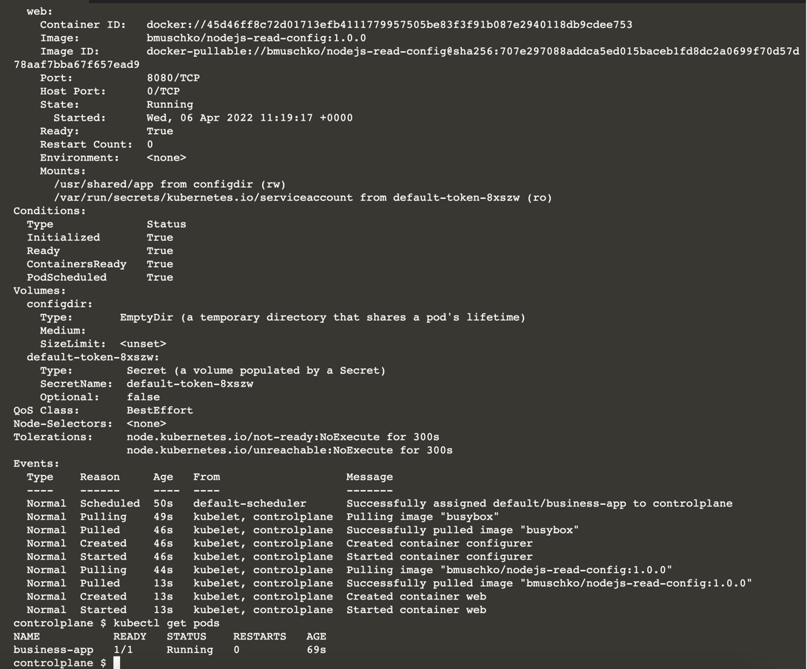

# Create an Init Container

Init containers run in the same Pod as the main application container, though with a separate life cycle. The pattern is often used to initialize a state or configuration for the application running in the main container. In this scenario, you will initialize a web application by standing up an environment-specific configuration through an init container.

In this scenario, you will:

Create a Pod running a web application inside of the main container.
Add an init container for downloading a configuration for the application.
Create a volume and mount it to the main container and the init container.

## Creating a Pod with an Init Container

Kubernetes runs an init container before the main container. 

In this scenario, the init container retrieves configuration files from a remote location and makes it available to the application running in the main container. 

The configuration files are shared through a volume mounted by both containers. 

The running application consumes the configuration files and can render its values.

Create a new Pod in a YAML file named business-app.yaml.

The Pod should define two containers, one init container and one main application container. Name the init container <b>configurer</b> and the main container <b>web</b>. 

The init container uses the image busybox, and the main container uses the image bmuschko/nodejs-read-config:1.0.0 running a Node.js application. Expose the main container on port 8080. You can find the source code of the application and its Dockerfile in this [source](https://resources.oreilly.com/katacoda-public-external-files/benjamin-muschko-external-files/tree/master/kubernetes-app-dev/creating-init-container/app/web).

Start by generating the YAML using the run command. For now, we do not deal with setting up the init container.

```
kubectl run business-app --image=bmuschko/nodejs-read-config:1.0.0 --restart=Never --port=8080 -o yaml --dry-run > business-app.yaml
```

Continue by editing the generated YAML content. Here, you should add the init container and rename the init and main container.

```
apiVersion: v1
kind: Pod
metadata:
  creationTimestamp: null
  labels:
    run: business-app
  name: business-app
spec:
  initContainers:
  - name: configurer
    image: busybox
  containers:
  - image: bmuschko/nodejs-read-config:1.0.0
    name: web
    ports:
    - containerPort: 8080
    resources: {}
  dnsPolicy: ClusterFirst
  restartPolicy: Never
status: {}
```

## Sharing Data Across Init and Main Containers

Further edit the YAML file by adding a new volume of type emptyDir that is mounted at /usr/shared/app for both containers. 

The result could look as follows.

```
apiVersion: v1
kind: Pod
metadata:
  creationTimestamp: null
  name: business-app
spec:
  initContainers:
  - name: configurer
    image: busybox
    volumeMounts:
    - name: configdir
      mountPath: "/usr/shared/app"
  containers:
  - image: bmuschko/nodejs-read-config:1.0.0
    name: web
    ports:
    - containerPort: 8080
    volumeMounts:
    - name: configdir
      mountPath: "/usr/shared/app"
    resources: {}
  dnsPolicy: ClusterFirst
  restartPolicy: Never
  volumes:
  - name: configdir
    emptyDir: {}
status: {}
```

Edit the YAML file by providing the command for the init container. 

The init container should run a wget command for downloading the file https://resources.oreilly.com/katacoda-public-external-files/benjamin-muschko-external-files/raw/master/kubernetes-app-dev/creating-init-container/app/config/config.json into the directory /usr/shared/app. 

The final YAML content of the Pod should look like the snippet below.

```aidl
apiVersion: v1
kind: Pod
metadata:
  creationTimestamp: null
  name: business-app
spec:
  initContainers:
  - name: configurer
    image: busybox
    command:
    - wget
    - "-O"
    - "/usr/shared/app/config.json"
    - https://resources.oreilly.com/katacoda-public-external-files/benjamin-muschko-external-files/raw/master/kubernetes-app-dev/creating-init-container/app/config/config.json
    volumeMounts:
    - name: configdir
      mountPath: "/usr/shared/app"
  containers:
  - image: bmuschko/nodejs-read-config:1.0.0
    name: web
    ports:
    - containerPort: 8080
    volumeMounts:
    - name: configdir
      mountPath: "/usr/shared/app"
    resources: {}
  dnsPolicy: ClusterFirst
  restartPolicy: Never
  volumes:
  - name: configdir
    emptyDir: {}
status: {}
```

### Running the Pod
During the creation of the Pod, you can follow the creation of individual containers. 

You may notice that the status value indicates the creation of the init container in the process by rendering the <b>Init</b> prefix.

```
kubectl create -f business-app.yaml

kubectl get pods

kubectl exec business-app -it -- /bin/sh
```



