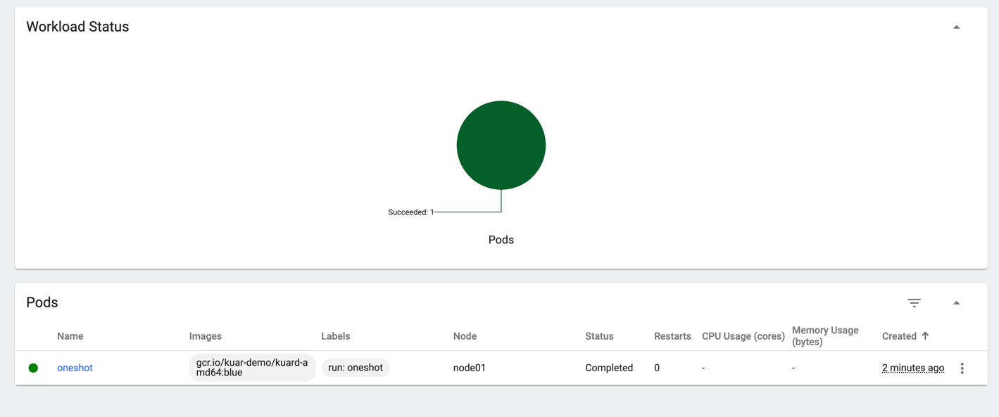
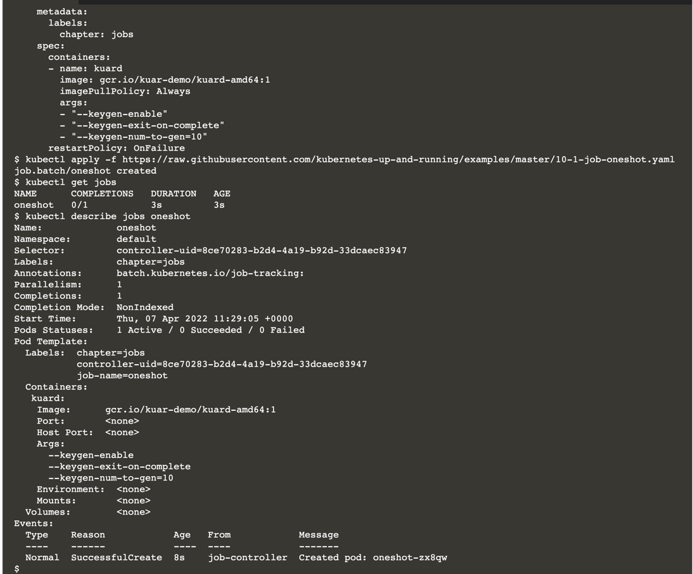
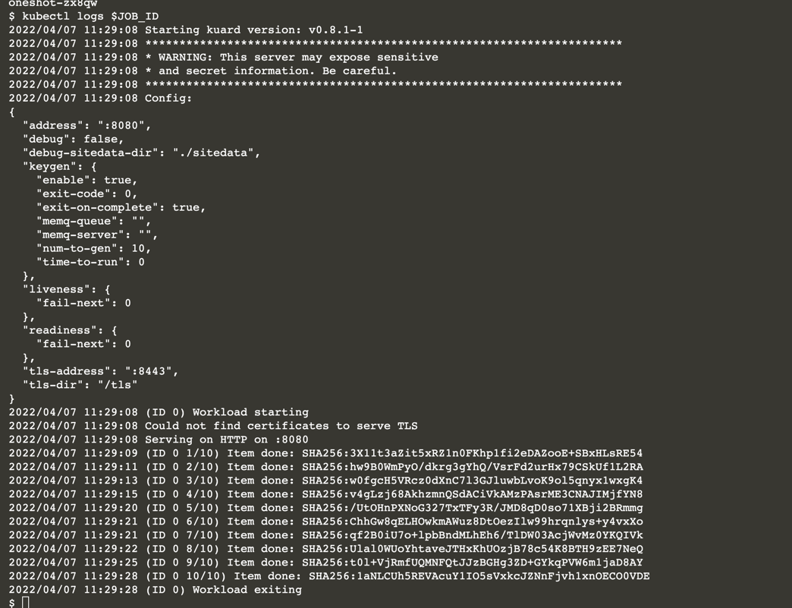

# Jobs

This scenario takes you through the basics of Job resources on Kubernetes. 

Chapter 12 of the 2019 O'Reilly Kubernetes Up & Running, 2nd edition book from Kelsey Hightower, Brendan Burns, and Joe Beda has a very nice explanation of Jobs. 

Therefore, this scenario is simply a manifestation of their explanation.

A Job creates Pods that run until successful termination (i.e., exit with 0). 

In contrast, a regular Pod will continually restart regardless of its exit code. 

Jobs are useful for things you only want to do once, such as database migrations or batch jobs. 

If run as a regular Pod, your database migration task would run in a loop, continually repopulating the database after every exit.

The Job object is responsible for creating and managing pods defined in a template in the Job specification. 

These pods generally run until successful completion. The Job object coordinates running multiple pods in parallel.

In the following steps you will learn:

* how Jobs are defined and work in Kubernetes,
* how Kubernetes resilience recovers failed jobs,
* how Job can serially or in parallel,
* why it's more efficient to run Jobs in parallel,
* how Jobs can process a work queue.


## Run Single Job

```
kubectl run -i oneshot \
  --image=gcr.io/kuar-demo/kuard-amd64:blue \
  --restart=OnFailure \
  -- \
     /kuard \
     --keygen-enable \
     --keygen-exit-on-complete \
     --keygen-num-to-gen 5
```

```
kubectl get jobs
kubectl get pods
```




If this was a Job it would have completed and cleaned up after itself. 

Since it's just a Pod, you now have garbage to clean up:

```
kubectl delete pod oneshot
```

## Job from Resource

It's generally preferable to define resources such as Jobs in resource manifests such as this YAML file:

```
curl https://raw.githubusercontent.com/kubernetes-up-and-running/examples/master/10-1-job-oneshot.yaml

apiVersion: batch/v1
kind: Job
metadata:
  name: oneshot
  labels:
    chapter: jobs
spec:
  template:
    metadata:
      labels:
        chapter: jobs
    spec:
      containers:
      - name: kuard
        image: gcr.io/kuar-demo/kuard-amd64:1
        imagePullPolicy: Always
        args:
        - "--keygen-enable"
        - "--keygen-exit-on-complete"
        - "--keygen-num-to-gen=10"
      restartPolicy: OnFailure
```



When Pods run the output from the containers is captured in the Pod's /var/log directory. 

If you know the name of the specific job instance, the logs command can extract that log.

With a little help from grep and cut the name of the job is extracted and passed to the logs command:

```
export JOB_ID=$(kubectl describe jobs oneshot | grep -o 'Created pod: .*' | cut -f3- -d' ')
echo $JOB_ID
kubectl logs $JOB_ID
```

The log will report 10 new keys were generated. Once you are done inspecting the Job, use the delete command to remove it:



```
kubectl delete jobs oneshot
```

## Job Failure

Failure is embraced as a first-class visitor in Kubernetes. 

All things are expected to fail at some point. Let's see the behavior when a Job fails.

By default, the kaurd container completes with a success exit code of 0. 

A command can be passed to force a different exit code. 

Inspect this job definition that forces the container to end with an exit code of 1 after generating 3 keys:

```
apiVersion: batch/v1
kind: Job
metadata:
  name: oneshot
  labels:
    chapter: jobs
spec:
  template:
    metadata:
      labels:
        chapter: jobs
    spec:
      containers:
      - name: kuard
        image: gcr.io/kuar-demo/kuard-amd64:1
        imagePullPolicy: Always
        args:
        - "--keygen-enable"
        - "--keygen-exit-on-complete"
        - "--keygen-exit-code=1"
        - "--keygen-num-to-gen=3"
      restartPolicy: OnFailure
```

```
kubectl get pod --selector job-name=oneshot
kubectl delete jobs oneshot
```

## Parallelism

A huge advantage of running applications on Kubernetes is there are typically large amounts of resources to utilize. 

So far these jobs have been working serially and underutilizing the resources. 

Often real jobs may be long-running and incur notable CPU and memory consumption. 

A helpful way to solve performance problems is by running the jobs in parallel. 

Instead of each job creating a series of keys serially,3 have multiple jobs work on smaller units of work.

### A Race

Let's have a race to validate this claim, even on this 2 node Kubernetes instance.

### Serially

```
kubectl apply -f https://raw.githubusercontent.com/kubernetes-up-and-running/examples/master/10-1-job-oneshot.yaml
```

This time we will watch for is the duration result. By inspecting the status times in the job's YAML the duration time can be extracted. It will be about 30 seconds before the end time is recorded. If a message:

```
echo "Duration: $(expr $(date +%s -d $(kubectl get job oneshot -o json | jq -r .status.completionTime)) - $(date +%s -d $(kubectl get job oneshot -o json | jq -r .status.startTime))) seconds"
```

```
export SERIAL_DURATION=$(expr $(date +%s -d $(kubectl get job oneshot -o json | jq -r .status.completionTime)) - $(date +%s -d $(kubectl get job oneshot -o json | jq -r .status.startTime)))
```

### Parallel

Here is a descriptor that will run the job in parallel. Inspect the definition:

```
curl https://raw.githubusercontent.com/kubernetes-up-and-running/examples/master/10-3-job-parallel.yaml
```

```
apiVersion: batch/v1
kind: Job
metadata:
  name: parallel
  labels:
    chapter: jobs
spec:
  parallelism: 5
  completions: 10
  template:
    metadata:
      labels:
        chapter: jobs
    spec:
      containers:
      - name: kuard
        image: gcr.io/kuar-demo/kuard-amd64:1
        imagePullPolicy: Always
        args:
        - "--keygen-enable"
        - "--keygen-exit-on-complete"
        - "--keygen-num-to-gen=10"
      restartPolicy: OnFailure
```

Notice in the spec: the two settings have been applied to ensure the <b>parallelism</b> features is enabled parallelism: 5 and <b>completions:</b> 10.

The template runs 10 jobs where each job generates 10 keys. For a better race comparison, we want 10 jobs that each generate a single key, so the template will be slightly modified using sed to change the keygen-num-to-gen value from 10 to 1

```
curl https://raw.githubusercontent.com/kubernetes-up-and-running/examples/master/10-3-job-parallel.yaml | sed '/num-to-gen=/s/=.*/=1"/' > job-parallel.yaml
```

```
apiVersion: batch/v1
kind: Job
metadata:
  name: parallel
  labels:
    chapter: jobs
spec:
  parallelism: 5
  completions: 10
  template:
    metadata:
      labels:
        chapter: jobs
    spec:
      containers:
      - name: kuard
        image: gcr.io/kuar-demo/kuard-amd64:1
        imagePullPolicy: Always
        args:
        - "--keygen-enable"
        - "--keygen-exit-on-complete"
        - "--keygen-num-to-gen=1"
      restartPolicy: OnFailure
```

```
export PARALLEL_DURATION=$(expr $(date +%s -d $(kubectl get job parallel -o json | jq -r .status.completionTime)) - $(date +%s -d $(kubectl get job parallel -o json | jq -r .status.startTime)))
```

## Race Results

```
clear && echo -e "For over a decade prophets have voiced the contention that the organization of a single computer has reached its limits and that truly significant advances can be made only by interconnection of a multiplicity of computers. - Gene Amdahl in 1967.\n\nThe results are in:\nSerial: $SERIAL_DURATION\nParallel: $PARALLEL_DURATION"
kubectl delete jobs --selector chapter=jobs
```

## Work Queue

Jobs are an effective mechanism to accept work from a queue and publish the results downstream when completed. 

Multiple Jobs can run asynchronously and in parallel to accept enqueued items and deque the items when completed.

This example starts up a simple queuing service, enqueues keygen request work items, then parallel jobs process the work items by submitting they keygen results back to the queue.

```
queue.yaml
apiVersion: apps/v1
kind: ReplicaSet
metadata:
  labels:
    app: work-queue
    component: queue
    chapter: jobs
  name: queue
spec:
  replicas: 1
  selector:
    matchLabels:
      app: work-queue 
  template:
    metadata:
      labels:
        app: work-queue
        component: queue
        chapter: jobs
    spec:
      containers:
      - name: queue
        image: "gcr.io/kuar-demo/kuard-amd64:1"
        imagePullPolicy: Always
```

## Submit Items to Queue

Create a collection of work items and place onto queue. First, use port forwarding locally as the shell script expects the queue service to be available on port 8080:

```
QUEUE_POD=$(kubectl get pods -l app=work-queue,component=queue -o jsonpath='{.items[0].metadata.name}')
kubectl port-forward $QUEUE_POD 8080:8080 > /dev/null &
curl https://raw.githubusercontent.com/kubernetes-up-and-running/examples/master/10-6-load-queue.sh | bash

View the enqueued items count, it will be 100:
curl localhost:8080/memq/server/stats | jq
```

You can also see the queue in the portal. Because of scenario's virtualization, you cannot address this URL from your browser, but you can use scenario'sdomain as the URL to the same service.

These commands will expose the service externally to scenario's subdomain scheme.

Expose the queue with a Kubernetes service to allow access to the Queue Portal:

```
kubectl apply -f https://raw.githubusercontent.com/kubernetes-up-and-running/examples/master/10-5-service-queue.yaml
kubectl patch service queue --type='json' --patch='[{"op": "replace", "path": "/spec/type","value":"NodePort"}]'
kubectl patch service queue --type='json' --patch='[{"op": "replace", "path":"/spec/ports/0/nodePort", "value":31001}]'
```

## Process Work Items

Inspect the new Jobs that will consume and work on these enqueued items. 

Notice the resource is defined with 5 jobs to run in parallel. 

Once all the queued items have been processed the jobs will complete:

```
curl https://raw.githubusercontent.com/kubernetes-up-and-running/examples/master/10-7-job-consumers.yaml
```

```
apiVersion: batch/v1
kind: Job
metadata:
  labels:
    app: message-queue
    component: consumer
    chapter: jobs
  name: consumers
spec:
  parallelism: 5
  template:
    metadata:
      labels:
        app: message-queue
        component: consumer
        chapter: jobs
    spec:
      containers:
      - name: worker
        image: "gcr.io/kuar-demo/kuard-amd64:1"
        imagePullPolicy: Always
        args:
        - "--keygen-enable"
        - "--keygen-exit-on-complete"
        - "--keygen-memq-server=http://queue:8080/memq/server"
        - "--keygen-memq-queue=keygen"
      restartPolicy: OnFailure
```

Create a parallel consumer Job:

```
kubectl apply -f https://raw.githubusercontent.com/kubernetes-up-and-running/examples/master/10-7-job-consumers.yaml
kubectl delete rs,svc,job --selector chapter=jobs
```