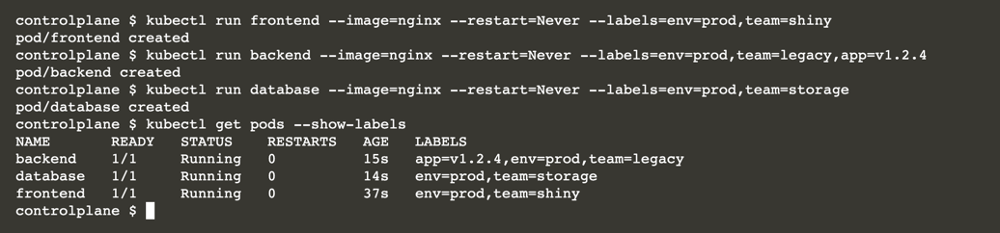
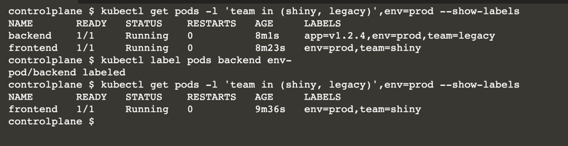
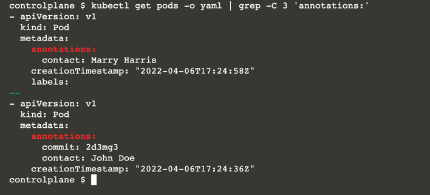

# Define and Query Labels and Annotations

Labels are key-value pairs assigned to Kubernetes resources as a way to provide metadata. 

This metadata can be used by selector queries or within selector sections in object definitions. 

Annotations look similar, but they are just meant for providing metadata for information purposes and cannot be used for querying operations. 

In this scenario, you will use labels and annotations for a set of Pods.

In this scenario, you will:

* Create Pods with labels.
* Declare annotations for Pods.
* Use label selectors to query Pods.
* Remove labels from a Pod.

Use the grep command to query Pod information.

## Creating Pods with Labels

Create three different Pods with the names <b>frontend, backend, and database</b> that use the image nginx. 

Declare labels for those Pods as follows:

* Pod named frontend
  env=prod
  team=shiny
  
* Pod named backend
  env=prod
  team=legacy
  app=v1.2.4
  
* Pod named database
  env=prod
  team=storage
  
```
kubectl run frontend --image=nginx --restart=Never --labels=env=prod,team=shiny
kubectl run backend --image=nginx --restart=Never --labels=env=prod,team=legacy,app=v1.2.4
kubectl run database --image=nginx --restart=Never --labels=env=prod,team=storage
kubectl get pods --show-labels
```



```
apiVersion: v1
kind: Pod
metadata:
  labels:
    app: v1.2.4
    env: prod
    team: legacy
  name: backend
  namespace: default
spec:
  containers:
  - image: nginx
    imagePullPolicy: Always
    name: backend
  restartPolicy: Never
```

## Using Label Selectors

Use label selectors on the command line to query all production Pods that belong to the teams <b>shiny</b> and <b>legacy</b>.

You can use the -l command-line option to specify your criteria. 

The following command also adds the <b>--show-labels</b> command-line option for verifying whether the query matches our expectations. 

The output should render the backend and frontend Pod.

```
kubectl get pods -l 'team in (shiny, legacy)',env=prod --show-labels
kubectl label pods backend env-
```

The kubectl executable provides a shortcut for removing labels by adding the minus character to the label name. 

The following command removes the label env from the backend Pod.



## Declaring Annotations

you will want to add annotations to the already existing Pods. Declare annotations for those Pods as follows:

* Pod named frontend -
  contact=John Doe
  commit=2d3mg3
* Pod named backend -
  contact=Mary Harris

You can also use the edit pod command to edit the YAML definition of a Pod. Use the annotate command as a shortcut:

```
kubectl annotate pod/frontend contact='John Doe' commit='2d3mg3'
kubectl annotate pod/backend contact='Marry Harris'
```

You likely already learned about the get pods -o yaml for rendering the YAML output for a single Pod. 

In real-world Kubernetes clusters, you may be tasked with finding all Pods with a specific annotation. 

You can combine the get pods command with the grep command to filter the information. 

Say you wanted to render the surrounding three lines of YAML for all Pods that have annotations.

```
kubectl get pods -o yaml | grep -C 3 'annotations:'
```



