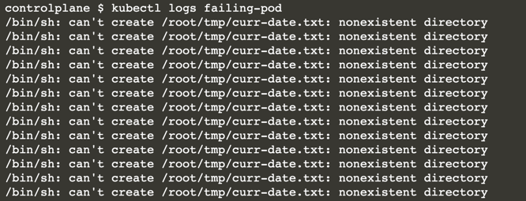

# Kubernetes: Fix a Misconfigured Pod

It's very common to encounter a situation where a Pod doesn't run as expected. As an application developer, you will need to understand how to approach the problem with different strategies. In this scenario, you will improve your debugging skills by inspecting and fixing a misconfigured Pod.

In this scenario, you will:

* Create a Pod.
* Identify an issue with the Pod using different commands.
* Fix the underlying issue.


## Creating a Pod

This scenario starts with a predefined Pod. 

The Pod uses the busybox image and executes a shell command in an infinite loop. 

Upon further inspection, you will see that command write the current date to the file ~/tmp/curr-date.txt, sleep five seconds, and then perform the same operation again. 

Create the file with the name pod.yaml.

```
apiVersion: v1
kind: Pod
metadata:
  creationTimestamp: null
  labels:
    run: failing-pod
  name: failing-pod
spec:
  containers:
  - args:
    - /bin/sh
    - -c
    - while true; do echo $(date) >> ~/tmp/curr-date.txt; sleep
      5; done;
    image: busybox
    name: failing-pod
    resources: {}
  dnsPolicy: ClusterFirst
  restartPolicy: Never
status: {}
```

```
kubectl create -f pod.yaml
```


## Identifying Issues with the Pod Listing the Pods

List the Pods. You should see the Pod named failing-pod.

The status is rendering Running. Supposedly, the Pod is running without problems.


Say you know that the application running inside the Pod isn't performing as expected. 

The next steps will help identify the root cause of the issue.

### Rendering the Logs

Render the logs of the container. The output should indicate an error message every five seconds.

```
kubectl logs failing-pod
```


### Logging into the Container

Apparently, the directory ~/tmp doesn't exist in the container. 

Let's log into the container and create the directory.

```
kubectl exec failing-pod -it -- /bin/sh

mkdir -p ~/tmp

cd ~/tmp
```

After waiting at least five seconds, you should see the file curr-date.txt. List the files in the directory and inspect the contents of the file.

What do you think would happen if you restart the Pod? You might have guessed it: the same issue would occur. A permanent fix to the problem would involve changing the command in the YAML file to create the directory first.

