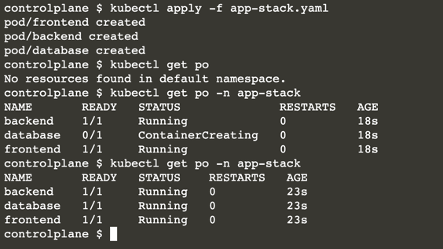
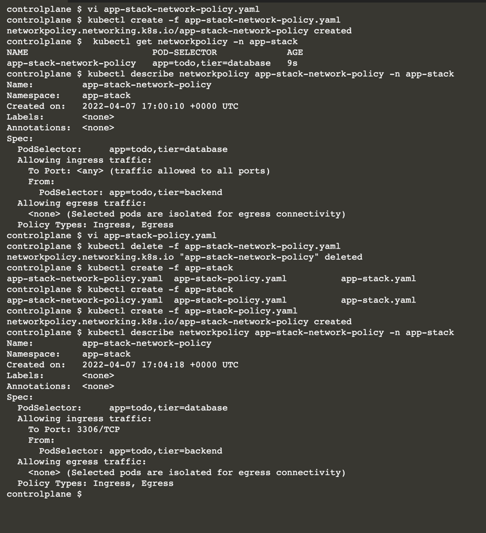

# Creating a Network Policy

* Setting up Pods
* Creating a Network Policy to control traffic
* Verifying the correct behavior

## Creating Pods

Assume an application stack that defines three different layers in the namespace app-stack: a frontend, a backend, and a database.

Each of the layers runs in a Pod.

You can find the definition in the YAML file app-stack.yaml.

Create the Pods using the YAML manifest.

Wait until all Pods transition into the "Running" status.

```
kind: Pod
apiVersion: v1
metadata:
  name: frontend
  namespace: app-stack
  labels:
    app: todo
    tier: frontend
spec:
  containers:
  - name: frontend
    image: nginx
---
kind: Pod
apiVersion: v1
metadata:
  name: backend
  namespace: app-stack
  labels:
    app: todo
    tier: backend
spec:
  containers:
  - name: backend
    image: nginx
---
kind: Pod
apiVersion: v1
metadata:
  name: database
  namespace: app-stack
  labels:
    app: todo
    tier: database
spec:
  containers:
  - name: database
    image: mysql
    env:
    - name: MYSQL_ROOT_PASSWORD
      value: example
```



```
apiVersion: networking.k8s.io/v1
kind: NetworkPolicy
metadata:
  name: app-stack-network-policy
  namespace: app-stack
spec:
  podSelector:
    matchLabels:
      app: todo
      tier: database
  policyTypes:
  - Ingress
  - Egress
  ingress:
  - from:
    - podSelector:
        matchLabels:
          app: todo
          tier: backend
          
kubectl get networkpolicy -n app-stack
```


You can further restrict the ports with the following definition:

```
apiVersion: networking.k8s.io/v1
kind: NetworkPolicy
metadata:
  name: app-stack-network-policy
  namespace: app-stack
spec:
  podSelector:
    matchLabels:
      app: todo
      tier: database
  policyTypes:
  - Ingress
  - Egress
  ingress:
  - from:
    - podSelector:
        matchLabels:
          app: todo
          tier: backend
    ports:
    - protocol: TCP
      port: 3306
```


