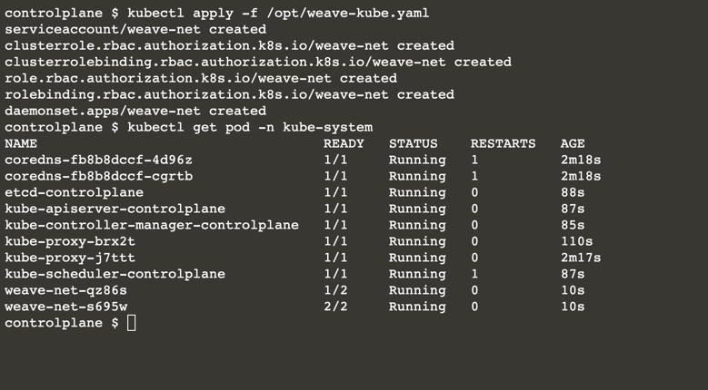

# Add Additional Nodes To Existing Cluster

how to add additional nodes to a Kubernetes cluster. This allows you to start exploring scaling and scheduling approaches of Kubernetes.


## Step 1 - Start Cluster

The command below will initialise the cluster with a known token to simplify the following steps

```
kubeadm init --token=102952.1a7dd4cc8d1f4cc5 --kubernetes-version $(kubeadm version -o short)
```

In production, it's recommend to exclude the token causing kubeadm to generate one on your behalf.

The command copies the configuration to the users home directory and sets the environment variable for use with the CLI.

```
sudo cp /etc/kubernetes/admin.conf $HOME/
sudo chown $(id -u):$(id -g) $HOME/admin.conf
export KUBECONFIG=$HOME/admin.conf
```

The admin.conf file includes the certificates required to access a cluster as an administrator.

## Step 2 - Add Node

Once the Master has initialised, additional nodes can join the cluster as long as they have the correct token. 

The tokens can be managed via kubeadm token, for example <b>kubeadm token list</b>

### Task

On the second node, run the command to join the cluster providing the IP address of the Master node.

```
kubeadm join --discovery-token-unsafe-skip-ca-verification --token=102952.1a7dd4cc8d1f4cc5 172.17.0.26:6443
```


## Step 3 - Deploy CNI

The Container Network Interface (CNI) defines how the different nodes and their workloads should communicate. There are multiple network providers available, some are listed [here](https://kubernetes.io/docs/concepts/cluster-administration/addons/).

### Task

we'll use WeaveWorks. The deployment definition can be viewed at


```
weave.yaml
apiVersion: v1
kind: List
items:
  - apiVersion: v1
    kind: ServiceAccount
    metadata:
      name: weave-net
      annotations:
        cloud.weave.works/launcher-info: |-
          {
            "original-request": {
              "url": "/k8s/v1.10/net.yaml?k8s-version=v1.16.0",
              "date": "Mon Oct 28 2019 18:38:09 GMT+0000 (UTC)"
            },
            "email-address": "support@weave.works"
          }
      labels:
        name: weave-net
      namespace: kube-system
  - apiVersion: rbac.authorization.k8s.io/v1
    kind: ClusterRole
    metadata:
      name: weave-net
      annotations:
        cloud.weave.works/launcher-info: |-
          {
            "original-request": {
              "url": "/k8s/v1.10/net.yaml?k8s-version=v1.16.0",
              "date": "Mon Oct 28 2019 18:38:09 GMT+0000 (UTC)"
            },
            "email-address": "support@weave.works"
          }
      labels:
        name: weave-net
    rules:
      - apiGroups:
          - ''
        resources:
          - pods
          - namespaces
          - nodes
        verbs:
          - get
          - list
          - watch
      - apiGroups:
          - networking.k8s.io
        resources:
          - networkpolicies
        verbs:
          - get
          - list
          - watch
      - apiGroups:
          - ''
        resources:
          - nodes/status
        verbs:
          - patch
          - update
  - apiVersion: rbac.authorization.k8s.io/v1
    kind: ClusterRoleBinding
    metadata:
      name: weave-net
      annotations:
        cloud.weave.works/launcher-info: |-
          {
            "original-request": {
              "url": "/k8s/v1.10/net.yaml?k8s-version=v1.16.0",
              "date": "Mon Oct 28 2019 18:38:09 GMT+0000 (UTC)"
            },
            "email-address": "support@weave.works"
          }
      labels:
        name: weave-net
    roleRef:
      kind: ClusterRole
      name: weave-net
      apiGroup: rbac.authorization.k8s.io
    subjects:
      - kind: ServiceAccount
        name: weave-net
        namespace: kube-system
  - apiVersion: rbac.authorization.k8s.io/v1
    kind: Role
    metadata:
      name: weave-net
      annotations:
        cloud.weave.works/launcher-info: |-
          {
            "original-request": {
              "url": "/k8s/v1.10/net.yaml?k8s-version=v1.16.0",
              "date": "Mon Oct 28 2019 18:38:09 GMT+0000 (UTC)"
            },
            "email-address": "support@weave.works"
          }
      labels:
        name: weave-net
      namespace: kube-system
    rules:
      - apiGroups:
          - ''
        resourceNames:
          - weave-net
        resources:
          - configmaps
        verbs:
          - get
          - update
      - apiGroups:
          - ''
        resources:
          - configmaps
        verbs:
          - create
  - apiVersion: rbac.authorization.k8s.io/v1
    kind: RoleBinding
    metadata:
      name: weave-net
      annotations:
        cloud.weave.works/launcher-info: |-
          {
            "original-request": {
              "url": "/k8s/v1.10/net.yaml?k8s-version=v1.16.0",
              "date": "Mon Oct 28 2019 18:38:09 GMT+0000 (UTC)"
            },
            "email-address": "support@weave.works"
          }
      labels:
        name: weave-net
      namespace: kube-system
    roleRef:
      kind: Role
      name: weave-net
      apiGroup: rbac.authorization.k8s.io
    subjects:
      - kind: ServiceAccount
        name: weave-net
        namespace: kube-system
  - apiVersion: apps/v1
    kind: DaemonSet
    metadata:
      name: weave-net
      annotations:
        cloud.weave.works/launcher-info: |-
          {
            "original-request": {
              "url": "/k8s/v1.10/net.yaml?k8s-version=v1.16.0",
              "date": "Mon Oct 28 2019 18:38:09 GMT+0000 (UTC)"
            },
            "email-address": "support@weave.works"
          }
      labels:
        name: weave-net
      namespace: kube-system
    spec:
      minReadySeconds: 5
      selector:
        matchLabels:
          name: weave-net
      template:
        metadata:
          labels:
            name: weave-net
        spec:
          containers:
            - name: weave
              command:
                - /home/weave/launch.sh
              env:
                - name: IPALLOC_RANGE
                  value: 10.32.0.0/24
                - name: HOSTNAME
                  valueFrom:
                    fieldRef:
                      apiVersion: v1
                      fieldPath: spec.nodeName
              image: 'docker.io/weaveworks/weave-kube:2.6.0'
              readinessProbe:
                httpGet:
                  host: 127.0.0.1
                  path: /status
                  port: 6784
              resources:
                requests:
                  cpu: 10m
              securityContext:
                privileged: true
              volumeMounts:
                - name: weavedb
                  mountPath: /weavedb
                - name: cni-bin
                  mountPath: /host/opt
                - name: cni-bin2
                  mountPath: /host/home
                - name: cni-conf
                  mountPath: /host/etc
                - name: dbus
                  mountPath: /host/var/lib/dbus
                - name: lib-modules
                  mountPath: /lib/modules
                - name: xtables-lock
                  mountPath: /run/xtables.lock
            - name: weave-npc
              env:
                - name: HOSTNAME
                  valueFrom:
                    fieldRef:
                      apiVersion: v1
                      fieldPath: spec.nodeName
              image: 'docker.io/weaveworks/weave-npc:2.6.0'
              resources:
                requests:
                  cpu: 10m
              securityContext:
                privileged: true
              volumeMounts:
                - name: xtables-lock
                  mountPath: /run/xtables.lock
          hostNetwork: true
          hostPID: true
          restartPolicy: Always
          securityContext:
            seLinuxOptions: {}
          serviceAccountName: weave-net
          tolerations:
            - effect: NoSchedule
              operator: Exists
          volumes:
            - name: weavedb
              hostPath:
                path: /var/lib/weave
            - name: cni-bin
              hostPath:
                path: /opt
            - name: cni-bin2
              hostPath:
                path: /home
            - name: cni-conf
              hostPath:
                path: /etc
            - name: dbus
              hostPath:
                path: /var/lib/dbus
            - name: lib-modules
              hostPath:
                path: /lib/modules
            - name: xtables-lock
              hostPath:
                path: /run/xtables.lock
                type: FileOrCreate
      updateStrategy:
        type: RollingUpdate
```



### Step 4 - Get Status

Once the CNI is deployed and running, the nodes will be available for scheduling.

View the status with 

```
kubectl get nodes
```