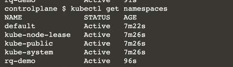
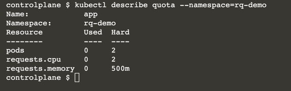
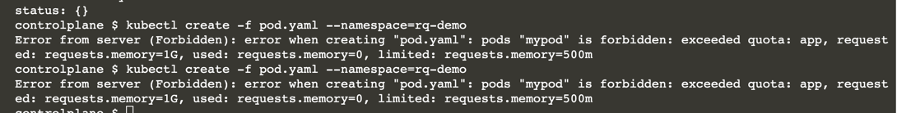

# Define a Pod’s Resource Requirements

In this scenario, you will create a ResourceQuota with specific CPU and memory limits for a new namespace. Pods created in the namespace will have to adhere to those limits.

In this scenario, you will:

* Create a ResourceQuota from a YAML definition.
* Inspect the ResourceQuota limits and resources consumed.
* Create a Pod that exceeds the limits of the ResourceQuota requirements.
* Change the minimum resource requirements for the Pod to allow for its creation.

## Distributing Resources to Pods

It's common in organizations to share a Kubernetes cluster with a fixed number of nodes across multiple teams or projects. 

A finite number of resources like CPU and memory raises the concern of sharing them fairly when operating multiple applications in parallel. 

Furthermore, during the development of an application it often becomes apparent (e.g., through load testing) that a minimum amount of resources is needed to run the application with a pleasant end user experience.

A ResourceQuota can define those upper limits of resources granted to a specific namespace. 

Any Pod created in the namespace can specify mimimal resource requirements as well as an upper limit of resources you want the application to grow. 

It's important to think about those numbers during application development because it helps with critically thinking about design decisions that may impact those requirements.

Defining those numbers also provides a safeguard for unforseen and unintentional situations that might arise during operations (e.g., memory leaks).

## Creating a ResourceQuota

A ResourceQuota is bound to a namespace. 

You'll start by creating a new namespace and then create the ResourceQuota for the namespace.

## Imperative Namespace Creation

```
kubectl create namespace rq-demo
kubectl get namespaces
```



## Declarative ResourceQuota Creation

A ResourceQuota cannot be created with the run command. 

You will need to start with a YAML definition. 

The ResourceQuota definition below describes the following constraints:

* This namespace allows a maximum of only two Pods.
* Every container must define a CPU request and memory request.
* The CPU request total for all containers must not exceed two CPUs.
* The memory request total for all containers must not exceed 500m.

```
rq.yaml
apiVersion: v1
kind: ResourceQuota
metadata:
  name: app
spec:
  hard:
    pods: "2"
    requests.cpu: "2"
    requests.memory: 500m
```

```
kubectl create -f rq.yaml --namespace=rq-demo
```

## Describing the Namespace

Describe that the proper resource requirements have been created. The <b>describe quota</b> renders an ASCII table that allows the comparison of used resources and upper limits for the namespace.

```
kubectl describe quota --namespace=rq-demo
```



## Creating a Pod with Minimum Resource Requirements

The Pod you are about to create should have the name mypod and use the image nginx. 

Use the run command in combination with the --dry-run command-line option to produce the YAML representation of the Pod.

```
kubectl run mypod --image=nginx --restart=Never -o yaml --dry-run > pod.yaml
```

```
apiVersion: v1
kind: Pod
metadata:
  creationTimestamp: null
  labels:
    run: mypod
  name: mypod
spec:
  containers:
  - image: nginx
    name: mypod
    resources: {}
  dnsPolicy: ClusterFirst
  restartPolicy: Never
status: {}
```

Now, the initial Pod YAML representation doesn't define any resource requirements for the container. You will need to add those manually by editing the YAML file.

For the container, specify a CPU request of 400m and 1 G of memory. Make sure to replace the existing resources: {} portion of the YAML definition generated by the run command. The resulting YAML could look like the one shown below.

```
apiVersion: v1
kind: Pod
metadata:
  creationTimestamp: null
  labels:
    run: mypod
  name: mypod
spec:
  containers:
  - image: nginx
    name: mypod
    resources:
      requests:
        memory: "1G"
        cpu: "400m"
  dnsPolicy: ClusterFirst
  restartPolicy: Never
status: {}
```

```
kubectl create -f pod.yaml --namespace=rq-demo
```

You will notice that the scheduler prevents the creation of the Pod because it doesn't adhere to the requirements set in the ResourceQuota. 

For this container, you requested a minimum of 1 G of memory, but the ResourceQuota only allows 500m.



## Fulfilling Resource Limits

Ensure that the memory request doesn't exceed 500m as definited by the ResourceQuota. 

For the container, specify a memory request of 200m. The resulting YAML could look like the one shown below.

```
apiVersion: v1
kind: Pod
metadata:
  creationTimestamp: null
  labels:
    run: mypod
  name: mypod
spec:
  containers:
  - image: nginx
    name: mypod
    resources:
      requests:
        memory: "200m"
        cpu: "400m"
  dnsPolicy: ClusterFirst
  restartPolicy: Never
status: {}
```

```
kubectl create -f pod.yaml --namespace=rq-demo
kubectl describe quota --namespace=rq-demo
```

