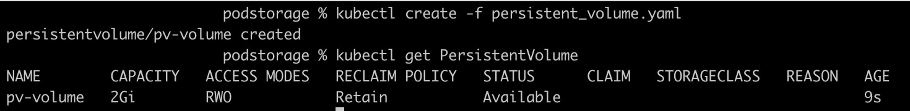
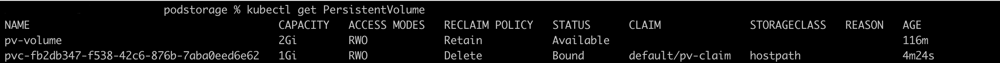

# This page explains kubernetes pod storage

 * Create an Persisitence volume
 * Create PersisitenceVolumeClaim
 * Attach Persistence Volume Claim to Pod

## Create an Persisitence volume

Below Kubernetes definition  creates persistence volume of the type hostpath

persistencevolume.yaml
```
kind: PersistentVolume
apiVersion: v1
metadata:
  name: pv-volume
  labels:
    type: local
spec:
  capacity:
    storage: 2Gi
  accessModes:
    - ReadWriteOnce
  hostPath:
    path: "/mydata"
```

```
kubectl create -f persistencevolume.yaml
```


## Create PersisitenceVolumeClaim

The Persistent Volume Claim (PVC) is used to connect to a Persistent Volume.
As you've noticed, there is nothing in the PVC that points to a specific PV. This leaves it up to the cluster to decide what it is going to bind to, and makes it easy to bind to storage in any cluster

persistent_volume_claim.yaml

```
kind: PersistentVolumeClaim
apiVersion: v1
metadata:
  name: pv-claim
spec:
  accessModes:
    - ReadWriteOnce
  resources:
    requests:
      storage: 1Gi
```



## Attach Persistence Volume Claim to Pod
Notice that it has a volume, which points to the Persistent Volume Claim you've created in the previous step, and it has a volumeMount that mounts this volume on the directory /usr/share/nginx/html

```
kind: Pod
apiVersion: v1
metadata:
   name: pv-pod
spec:
  volumes:
    - name: pv-storage
      persistentVolumeClaim:
        claimName: pv-claim
  containers:
    - name: pv-container
      image: nginx
      ports:
        - containerPort: 80
          name: "http-server"
      volumeMounts:
        - mountPath: "/usr/share/nginx/html"
          name: pv-storage
```