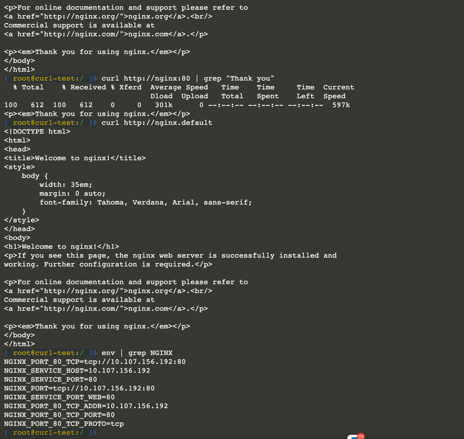

# Pods to Services Communication

The 4th factor (Backing services) of the [Twelve-Factor App Methodology](https://en.wikipedia.org/wiki/Twelve-Factor_App_methodology) states:

The code for a twelve-factor app makes no distinction between local and third party services. To the app, both are attached resources, accessed via a URL or other locator/credentials stored in the config.

In the following steps you will learn:

* how your containerized application can find and call other services,
* how DNS providers can plug themselves into the cluster,
* how service discovery works in Kubernetes.

## Communication from Pods to Services

An immediate benefit Kubernetes provides developers of containers is a level playing field for communicating between containers

Each container runs in a Pod, each Pod is fronted by a Service that routes traffic to its associated Pods, round-robin style

While each Pod in Kubernetes' network plane is assigned a virtual IP, you should not connect to containers with these IPs.

In fact, within your container code there should typically be no coupling to the Kubernetes ecosystem.

To start communicating to a Service and its associated Pod, install a small, typical NGINX application. Add a NGINX deployment with an associated service named nginx to the default namespace:

Verify the NGINX deployment is available (1) with two runnings pods and a service:

```
kubectl apply -f https://raw.githubusercontent.com/javajon/kubernetes-fundamentals/master/nginx/nginx.yaml

kubectl get services,pods,deployments
```

Now, let's communicate with the service.

Communication is easy with the assistance of an internal DNS service. 

This is where Kubernetes' resource object names and labels are helpful. 

Services all have declared names and the service names become the key names the DNS uses to find the services

```
kubectl run curl-test --image=radial/busyboxplus:curl -i --tty --rm
```

Because the busyboxplus container is running in the same namespace (default) as the NGINX service, the URL is small and simple:


```
curl http://nginx
curl http://nginx:80 | grep "Thank you"
curl http://nginx.default
curl --silent http://nginx.default.svc.cluster.local:80 | grep "Thank you"
env | grep NGINX
```


Tip: Try to leave most communication on port 80 or a common port the service expects to be on. 
Later add a meshing network like Istio. Without further code modifications, Istio can step in to ensure all intra-communication is secured with mutual TLS and monitored for tracing and metrics.



## DNS for Services and Pods

Kubernetes clusters have some form of a Domain Name System (DNS) handler. DNS is the heart of service discovery and like everything in Kubernetes, it runs in a container as it handles the lookups. There are a variety of providers for Kubernetes DNS solutions. In 2018 CoreDNS became a preferred solution in the community.

```
kubectl get services,pods,deployments -l 'k8s-app=kube-dns' --namespace kube-system
```

https://kubernetes.io/docs/tasks/administer-cluster/dns-custom-nameservers/