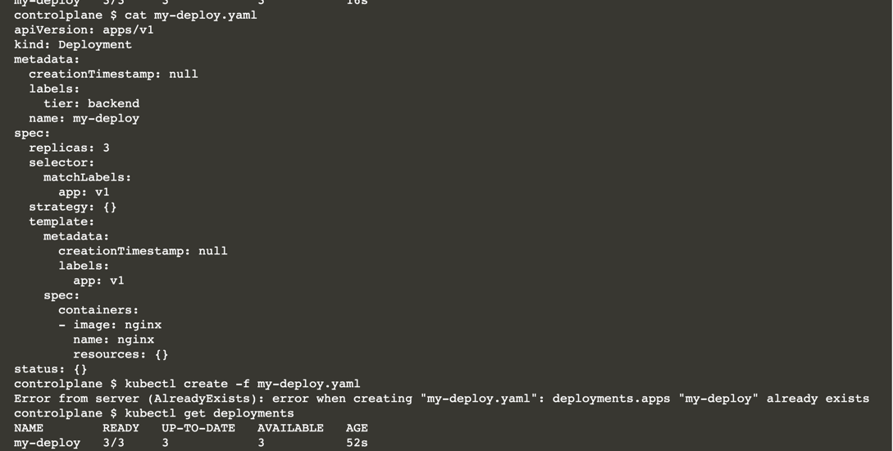

# Perform Rolling Updates for a Deployment

In this scenario, you will create a Deployment with multiple replicas. After inspecting the Deployment, you will update its parameters. Furthermore, you will use the rollout history to roll back to a previous revision.

In this scenario, you will:

* Create a Deployment.
* Change the number of replicas.
* Roll out a new version.
* Roll back to a previous version.

## Creating a Deployment with Multiple Replicas

Creating a single Pod running your application is straightforward

The popularity of the application may increase, and therefore the external traffic coming into the Pod from customers.

Instead of manually creating multiple identical Pods with the same configuration manually, you can simply decide to create a Deployment.

A Deployment can run multiple replicas of your application. 

Moreover, the Kubernetes resource provides capabilities for rolling out new versions of an application and rolling back to a previous version of the application.

## Creating a Deployment

Create a Deployment named <b>my-deploy</b> with three replicas

The Pods should use the <b>nginx</b> image and the name </b>nginx</b>.

The Deployment uses the label <b>tier=backend</b>. The Pods should use the label <b>app=v1</b>

```
kubectl create deployment my-deploy --image=nginx --dry-run -o yaml > my-deploy.yaml
```

```
apiVersion: apps/v1
kind: Deployment
metadata:
  creationTimestamp: null
  labels:
    tier: backend
  name: my-deploy
spec:
  replicas: 3
  selector:
    matchLabels:
      app: v1
  strategy: {}
  template:
    metadata:
      creationTimestamp: null
      labels:
        app: v1
    spec:
      containers:
      - image: nginx
        name: nginx
        resources: {}
status: {}
```



## Scaling the Number of Replicas

You can scale the Deployment to five replicas by running the command that follows.

```
kubectl scale deployments my-deploy --replicas=5
```


After awhile, the values of the columns READY and AVAILABLE will render five replicas.


## Rolling Out and Rolling Back Versions

Update the image to <b>nginx:latest</b> for any Pod of the Deployment with the name <b>nginx</b>

```
kubectl set image deployment/my-deploy nginx=nginx:latest
```

## Inspecting the Rollout History

The changed desired state causes the Deployment to add a new revision to the rollout history. 

Have a look at the Deployment rollout history with the command

```
 kubectl rollout history deploymens
 
 kubectl rollout history deploymens my-deploy --revision=2
  
 kubectl rollout history deploymens my-deploy --revision=1
```


### Rolling Back to a Previous Version

Let's assume the new version of the application had a bug and you want to roll back to revision 1. Use the <b>rollout undo</b> command in conjunction with the command-line option <b>--to-revision</b>.

```
kubectl rollout undo deployments my-deploy --to-revision=1
```

The rollout history now shows two different revisions, 2 and 3. You might wonder what happened to revision number 1. Effectively, revision 1 became revision 3 because their configuration is identical.

```
kubectl rollout history deployments my-deploy --revision=3
```


