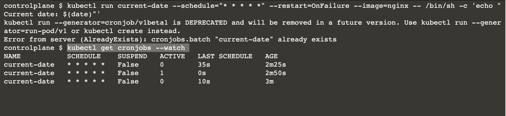

#  Create a Scheduled Container Operation

The purpose of a Pod is to continuously operate an application, and therefore represent a long-running operation. 

In comparison, a periodic job is a time-based job that executes application logic based on a given schedule. 

In this scenario, you will create a CronJob, the Kubernetes primitive for this kind of operation, and render its executions.

In this scenario, you will:

* Create a CronJob on a schedule.
* Watch the jobs as they are being scheduled.
* Delete the CronJob.

## Create a CronJob and Watch Its Execution

Create a new CronJob named current-date with the image nginx that should run every minute. 

To represent application logic, you will add the command sh -c 'echo "Current date: $(date)"'. 

The run command is deprecated, but it provides a good shortcut for creating a CronJob with a single command.

```
kubectl run current-date --schedule="* * * * *" --restart=OnFailure --image=nginx -- /bin/sh -c 'echo "Current date: $(date)"'
```

```
apiVersion: batch/v1beta1
kind: CronJob
metadata:
  creationTimestamp: "2022-04-06T13:45:37Z"
  labels:
    run: current-date
  name: current-date
  namespace: default
  resourceVersion: "3384"
  selfLink: /apis/batch/v1beta1/namespaces/default/cronjobs/current-date
  uid: d6f9ff65-b5af-11ec-95ef-0242ac11000c
spec:
  concurrencyPolicy: Allow
  failedJobsHistoryLimit: 1
  jobTemplate:
    metadata:
      creationTimestamp: null
    spec:
      template:
        metadata:
          creationTimestamp: null
          labels:
            run: current-date
        spec:
          containers:
          - args:
            - /bin/sh
            - -c
            - 'echo "Current date: $(date)"'
            image: nginx
            imagePullPolicy: Always
            name: current-date
            resources: {}
            terminationMessagePath: /dev/termination-log
            terminationMessagePolicy: File
          dnsPolicy: ClusterFirst
          restartPolicy: OnFailure
          schedulerName: default-scheduler
          securityContext: {}
          terminationGracePeriodSeconds: 30
  schedule: '* * * * *'
  successfulJobsHistoryLimit: 3
  suspend: false
status: {}
```
## Watching CronJob Execution

Every minute, a new execution will be created. 

Watch the jobs as they are executed by adding the --watch command-line option.

You will see that the name of every CronJob appends a suffix.

```
kubectl get cronjobs --watch
```



## Identifying Corresponding Pods

After the CronJob runs at least once, identify one of the corresponding Pods. 

The label with the key job-name clearly indicates the CronJob it belongs to. 

Furthermore, render the logs of the Pod with the logs command. 

You should see the timestamp of the execution.

The value of the attribute successfulJobsHistoryLimit defines how many executions are kept in the history. The default value is 3.

```
kubectl get cronjobs current-date -o yaml | grep successfulJobsHistoryLimit:
```

## Deleting the CronJob

Finally, delete the CronJob.

```
kubectl delete cronjob current-date
```

