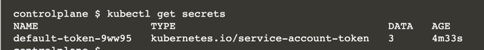
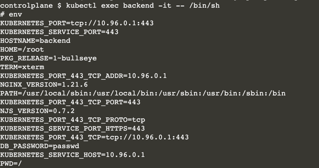

# Create and Use a Secret

In this scenario, you will create a Secret from literal values. 

Later, you'll create a Pod, consume the Secret as an environment variable, and print out its values from within the container. 

As part of this scenario, you will also learn how to remap the environment variable keys sourced from the Secret to a different key for use in the Pod.

In this scenario, you will:

* Create a Secret from literal values.
* Inject the Secret as an environment variable into a Pod.
* Change the key of environment variables for more convenient consumption.

## Difference Between ConfigMap and Secret

The major difference between a ConfigMap and a Secret is that Secrets are meant for storing and managing sensitive information like a password. 

The usage patterns of a Secret are very similar to those of a ConfigMap, however, the actual data is Base64-encoded. Remember that Base64 encoding is not a viable way to encrypt data and is considered the same as plain text simply because you can easily decode it.

So what is the benefit of using a Secret over a ConfigMap, you might ask? 

A Secret is only distributed to Kubernetes nodes running Pods that actually need the resource. 

Furthermore, Secrets are only stored in memory and not written to physical storage for nodes that use it.

Say we wanted to define a database password in a Secret. 

Instead of using a file, we will just provide the value in plain text when creating the Secret. 

In the next step, you will use the password as the source of truth for creating the Secret.

## Creating a Secret

The <b>kubectl</b> executable provides a subcommand for creating a Secret: create secret.

Apart from the name, you will need to declare the type of Secret and the source of the key-value pairs. A literal value is considered a generic Secret type.

```
kubectl create secret generic db-credentials --from-literal=db-password=passwd
```

Ensure that the object was created properly by viewing all Secrets.



Furthermore, inspect the YAML representation of the Secret with the following command.

```
kubectl get secret db-credentials -o yaml

apiVersion: v1
data:
  db-password: cGFzc3dk
kind: Secret
metadata:
  creationTimestamp: "2022-04-06T12:45:27Z"
  name: db-credentials
  namespace: default
  resourceVersion: "1093"
  selfLink: /api/v1/namespaces/default/secrets/db-credentials
  uid: 6f2f9012-b5a7-11ec-9d2e-0242ac11002c
type: Opaque
```

The Secret declares the key-value pairs under the section data. 

You will notice that the value of the key db-password has been converted in encoded form. 

It's time the inject the configuration value in a Pod.

## Consuming the Secret

The <b>run</b> command doesn't expose an option for pointing a Pod to a Secret. 

You'll have to start by generating the YAML representation of the Pod by executing the command in the dry-run mode.

```
kubectl run backend --image=nginx --restart=Never -o yaml --dry-run > pod.yaml
```

You might have noticed that the key of the Secret doesn't follow typical conventions for environment variables (all caps). Sometimes you can't simply change the Secret because it might be used by other Pods already. Under the container specification, add a section named env as a pointer to the Secret. You can still map the key of the Secret to a new environment variable that follows typical conventions.

```
apiVersion: v1
kind: Pod
metadata:
  creationTimestamp: null
  labels:
    run: backend
  name: backend
spec:
  containers:
  - image: nginx
    name: backend
    env:
      - name: DB_PASSWORD
        valueFrom:
          secretKeyRef:
            name: db-credentials
            key: db-password
    resources: {}
  dnsPolicy: ClusterFirst
  restartPolicy: Never
status: {}
```

```
kubectl exec backend -it -- /bin/sh

env
```

