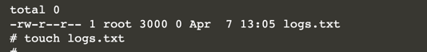

# Create a Security Context for a Pod

you will create a Pod that defines a filesystem group ID as a security context. 

Based on this security context, you'll create a new file and inspect the outcome based on the rule defined earlier.

In this scenario, you will:

* Create a new Pod.
* Define a volume for the Pod and mount it in the container.
* Specify a security context on the Pod level.

## Why Define a Security Context?

A security context defines privilege and access control settings for a Pod or Container. 

For example, you could specify permissions to a file based on the group ID (GID) or you could grant privileges to a process that diverts from the root user privileges.

By default, a Pod does not provide a security context. 

It's a good idea from a security perspective to restrict which user can run the application inside of the container and which files and directories the user can access. 

This scenario will focus on a single aspect of security contexts as an example: access to files.

## Creating a Pod with a Volume

A security context is defined as part of a Pod's spec. 

In this step, you will lay the groundwork by creating a new Pod that mounts a volume. 

Start by generating the YAML representation of a Pod that uses the nginx image.

```
kubectl run secured --image=nginx --restart=Never -o yaml --dry-run > secured.yaml
```

```
apiVersion: v1
kind: Pod
metadata:
  creationTimestamp: null
  labels:
    run: secured
  name: secured
spec:
  containers:
  - image: nginx
    name: secured
    resources: {}
  dnsPolicy: ClusterFirst
  restartPolicy: Never
status: {}
```

```
apiVersion: v1
kind: Pod
metadata:
  creationTimestamp: null
  labels:
    run: secured
  name: secured
spec:
  containers:
  - image: nginx
    name: secured
    volumeMounts:
    - name: data-vol
      mountPath: /data/app
    resources: {}
  volumes:
  - name: data-vol
    emptyDir: {}
  dnsPolicy: ClusterFirst
  restartPolicy: Never
status: {}
```

## Assigning a Security Context

t's time to create a security context for the Pod. 

For this exercise, you will want to specify that files created on the volume should use the filesystem group ID 3000. 

Define the security context on the Pod level, meaning directly underneath the spec element.

```
apiVersion: v1
kind: Pod
metadata:
  labels:
    run: secured
  name: secured
spec:
  containers:
  - image: nginx
    name: secured
    volumeMounts:
    - name: data-vol
      mountPath: /data/app
    resources: {}
  securityContext:
    fsGroup:  3000
  volumes:
  - name: data-vol
    emptyDir: {}
  dnsPolicy: ClusterFirst
  restartPolicy: Never
status: {}
```

List the file in the current directory. You should see that the group ID 3000 has been assigned to the new file as defined by the security context.


```
kubectl get pods
kubectl exec -it secured -- /bin/sh
cd /data/app
touch logs.txt
ls -l
```



