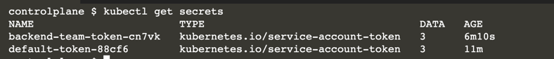
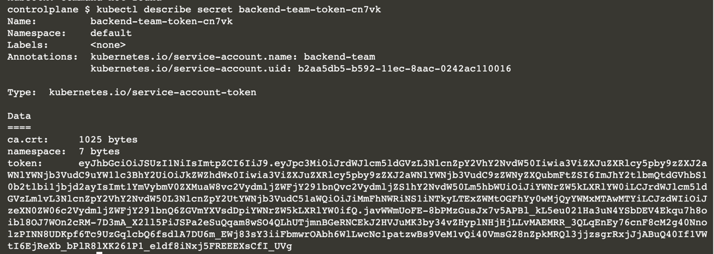
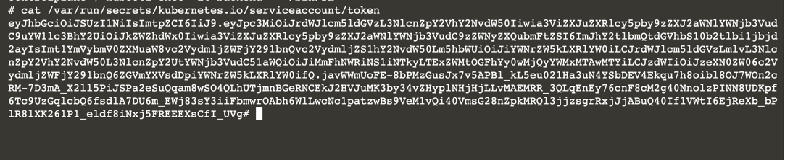

# Servicce Account

Managing ServiceAccounts is usually a concern that the Kubernetes Administrator has to deal with. 

Your role as an application developer primarily involves assigning a specific ServiceAccount to a Pod. 

In this scenario, you will practice this activity.

* Create a ServiceAccount.
* Use the ServiceAccount in a Pod.
* Render the token of the ServiceAccount from within the container.


## Creating a ServiceAccount

Some applications running in a Pod need to communicate with the API server to retrieve information about the cluster. 

For example, an application may want to query the status of cluster nodes or the Pods running a specific namespace. 

A ServiceAccount is used by containers running in a Pod to communicate with the API server of the Kubernetes cluster using an authentication token.

### ServiceAccount Creation

By default, a Pod uses the default ServiceAccount. In this scenario, we want to create a new ServiceAccount and use it in a Pod.

Start by creating the ServiceAccount named <b>backend-team</b> with the command <b>create serviceaccount</b>. You could also use the short form, sa.

```
kubectl create serviceaccount backend-team
```


### Inspecting the ServiceAccount

Inspect the ServiceAccount by asking for its YAML representation. 

The YAML output contains a reference to the Secret used by the ServiceAccount.

```
kubectl get serviceaccount backend-team -o yaml

apiVersion: v1
kind: ServiceAccount
metadata:
  creationTimestamp: "2022-04-06T10:17:00Z"
  name: backend-team
  namespace: default
  resourceVersion: "1027"
  selfLink: /api/v1/namespaces/default/serviceaccounts/backend-team
  uid: b2aa5db5-b592-11ec-8aac-0242ac110016
secrets:
- name: backend-team-token-cn7vk
```

Usually, you would create a Role and RoleBinding to the custom ServiceAccount to associate the permissions mentioned above. 


### Inspecting the Associated Secret

A Secret is created automatically for a ServiceAccount. 

You should be able to find the Secret by listing all of them with the get secrets command.



You will find a Secret that starts with the name of the ServiceAccount, backend-team. 

The describe secret renders the authentication token.



### Using the ServiceAccount in a Pod

The run provides a command-line option named <b>--serviceaccount</b> for providing the name of the ServiceAccount upon creation. 

Create a new Pod named backend with the image nginx.

```
kubectl run backend --image=nginx --restart=Never --serviceaccount=backend-team
```


### Inspecting the Authentication Token

Inspect the Pod's status by running the following command:

```
kubectl get pod backend

kubectl exec -it backend -- /bin/sh

cat /var/run/secrets/kubernetes.io/serviceaccount/token
```



