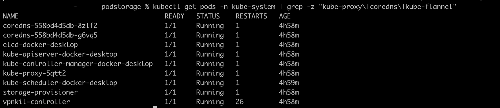
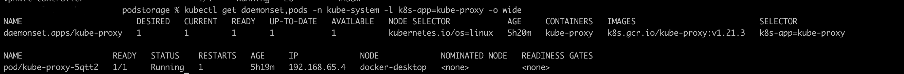
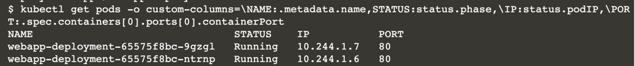
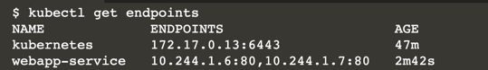
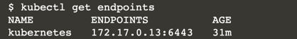
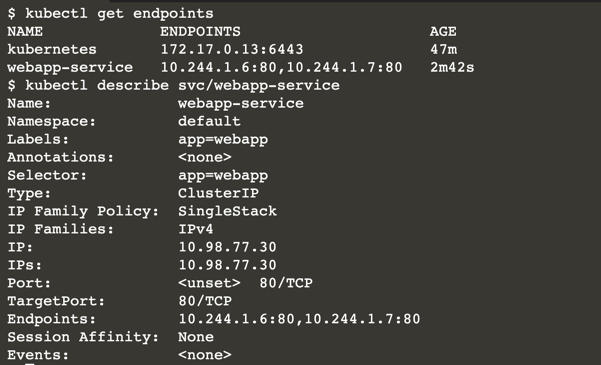
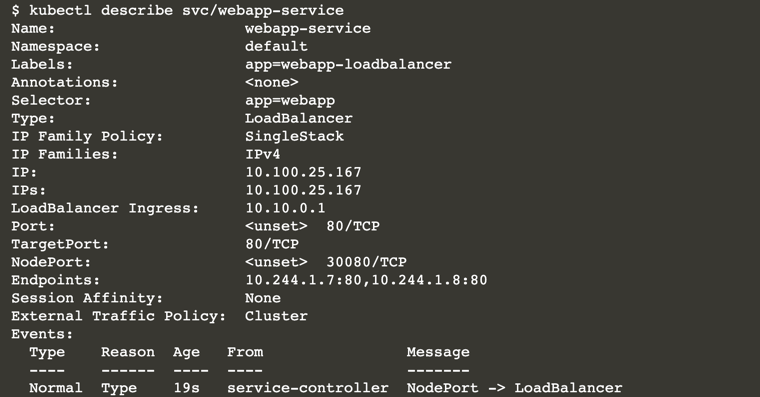

# Service Discovery

Distributing applications across a cluster can significantly complicate the way you design, run, and monitor an application. 

Kubernetes is an operating system that reduces the complexity of distributed computing. 

Service discovery is important because it allows you to find and access services that are distributed across a cluster. 

The Kubernetes Service resource is central to service discovery and makes it easier to connect applications across your cluster, compared to imperative application networking. 

With the Service resource, you can declare a policy and approach to access a set of Pods. 

Once you understand how Services can be declared and controlled, it should then be easier for you to design solutions orchestrated across a cluster.

* How to expose an application with a service using just labels
* How to expose an application using ClusterIP, NodePort, and LoadBalancer
* How to set port, targetPorts, and nodePort settings
* How kube-proxy and a DNS process are key control plane components for service discovery

The Service resource can be defined with these four types:

* ClusterIP
* NodePort
* LoadBalancer
* ExternalName


## Kubernetes Services

Services in Kubernetes provide:

* An addressable proxy to a set of pods
* An internal load balancer

Most applications in Pods on Kubernetes have a replication of cloned instances to support resilience, availability, and efficient traffic handling. 

Your applications can be scaled up and down while maintaining a single service entry point for access and traffic balancing. 

While Pods may come and go, the lifecycle of services tends to be longer and remain the reliable access point. Services are connected to Pods using matching labels. 

A Service declaration can be one of 4 types:

| Service type | Scope |
| ----------- | ----------- |
| Cluster IP      | Service can only be reached by other applications within the cluster. The most common and default type.       |
| NodePort   | The Service is exposed as a static port on each Node in the cluster. Access from outside the cluster to the Service is via <NodeIP>:<NodePort>. Each NodePort is unique to the cluster at the default range 30000-32767.        |
|Load Balancer|  Connects an external load balancer from your cloud to the Service. |
|ExternalName |  Access for in-cluster applications to reach other services in a different namespace, a different cluster, or some application outside the clusters, such as a cloud service.           |


The first three are the most common types and are proxies for a group of Pods, while ExternalName is a Canonical Name record (CNAME) to represent another remote service address.

The controller for the Kubernetes Service coordinates with the kube-proxy daemons on every cluster node and the cluster-wide DNS service

## Control Plane for Network Services

On a Kubernetes cluster, three important processes enable the service discovery and traffic routing between services. Take a look at your cluster and list the Kubernetes control plane Pods:

```
kubectl get pods -n kube-system | grep -z "kube-proxy\|coredns\|kube-flannel"
```



## Kube-flannel

This is a Container Network Interface (CNI) plugin. The CNI plugin is responsible for the network connectivity of containers throughout the cluster.

Flannel is an old standard plugin choice from over two dozen CNI plugins you'll find installed on differing Kubernetes targets. 

Each plugin is offered by a variety of organizations and support communities and each varies in features such as performance and security.

## Kube-proxy

The kube-proxy is deployed as a daemon on every node in your cluster. Here is the DaemonSet object for the kube-proxy:

```
kubectl get daemonset,pods -n kube-system -l k8s-app=kube-proxy -o wide
```


Every Pod and Service object is assigned a virtual IP. 

Pods and Services come and go all the time, so the kube-proxy ensures the iptables are updated each time a virtual IP is added and removed across all the Nodes in the cluster. 

From a developer perspective, you don't need to worry about the complexities of configuring and maintaining these networking rules and tables. 

This is a huge feature that Kubernetes takes care of so you can concentrate on higher-level aspects of your application.


```
Proxy-mode: The two primary methods for networking machines together are iptables and IPVS. 

By default, the Kubernetes kube-proxy process leverages IPTables.
 
Since Kubernetes 1.9, traffic routing can also be done with IPVS. IPTables is just fine for modest clusters, whereas IPVS has significant performance benefits when you reach 5000+ services on a cluster (a good problem to have when you get there). 

The parameters --proxy-mode=ipvs | iptables | userspace | kernelspace are given to the kube-proxy service when a cluster is started. Userspace is older and has performance limitations. 

Kernelspace is for Windows hosts. For this scenario and many of your clusters, you will most likely have a kube-proxy started in the iptables proxy-mode.
```


## Domain Name System (DNS)

While it's great that Kubernetes handles all of the virtual IPs, the last thing you want to worry about is IP addresses, since the IPs are changing all the time. 

The Domain Name System (DNS) provides a lookup where you can refer to other services by assigned, unique names. The DNS resolves the names to the current addresses.

When you create a Service, a corresponding DNS entry is also created. For instance, if you create a service called weather in a namespace called my_solution, then a DNS entry is created of the form weather.my-solution.svc.cluster.local that resolves to the IP of the service.

When other applications refer to this URL, the DNS service will resolve the address to the current IP of the service. All Kubernetes clusters have a DNS control plane component. 

The opinionated implementation is CoreDNS, but it can be substituted for special needs. You can see if CoreDNS is running:

```
kubectl get rs,pods -n kube-system -l k8s-app=kube-dns
```

By default, there are two Pods handling the DNS work. The DNS service is available for servicing any DNS translation request:

```
kubectl describe endpoints -n kube-system -l k8s-app=kube-dns
```

You'll notice the coredns Pods and ReplicaSets are labeled with kube-dns and the endpoints are labeled the same. 

The default implementation for DNS used to be a project called kube-dns, which has since been deprecated and substituted with coredns. However, the labels and endpoint names remain as kube-dns for backward compatibility.

In the next step, we'll start a Service and Pod to see these control plane components work for us.

## Deploy Pods and Service

we'll connect a Service with the three most common types: Cluster IP, NodePort, and Load Balancer. As we switch between the service types, each Service will connect to the same application. The application Deployment declaration looks like this:

```
apiVersion: apps/v1
kind: Deployment
metadata:
  name: webapp-deployment
spec:
  replicas: 2
  selector:
    matchLabels:
      app: webapp
  template:
    metadata:
      labels:
        app: webapp
    spec:
      containers:
      - name: webapp
        image: katacoda/docker-http-server:latest
        ports:
        - name: webport
          containerPort: 80
```

The application is identified as name: webapp-deployment and the selector to match the three Service variants is app: webapp. The replicas is set to 2.

Deploy the simple web application as a Deployment:

```
kubectl apply -f app-deployment.yaml
```

Notice that once each Pod is running, it is assigned a virtual IP unique to the cluster scope:

```
kubectl get pods -o custom-columns=\NAME:.metadata.name,STATUS:status.phase,\IP:status.podIP,\PORT:.spec.containers[0].ports[0].containerPort
```



However, these IPs are not addressable endpoints, and if you asked Kubernetes for the addressable endpoints in the default namespace, the pod IPs will not be listed:

```
kubectl get endpoints
```


The last thing any other application should do is to try to discover and connect to these IPs. 

Since the application is managed under a Deployment, the actual number of Pods and lifecycle longevity should be embraced as ephemeral. 

By adding and connecting to a representational Service we can isolate from these inevitable Pod endpoint changes. 

In the next step, we'll add a simple Service with the type ClusterIP for service discovery to these Pod IPs.

## Cluster IP

* Cluster IP is the default approach when defining a Kubernetes Service resource. 
* The Service is allocated an internal IP that other applications can reference in order to access its associated pods. 
* ClusterIP is the most limited exposure for a service,in that only other applications within the cluster can access a clusterIP-based service.

Here is an example Service manifest defined using the type ClusterIP:

```
apiVersion: v1
kind: Service
metadata:
  name: webapp-service
  labels:
    app: webapp
spec:
  type: ClusterIP
  ports:
  - port: 80
  selector:
    app: webapp
```

```
kubectl apply -f service-clusterip.yaml
kubectl get services -o wide
```

The service has a selector that matches the Pod Deployment label app=webapp. 
You can verify the Service is connected to the Pods by inspecting the endpoints:

```
kubectl get endpoints
```



The IPs listed are the virtual IPs of the Pods. The Service is also assigned a virtual IP. 

More details on the Service configuration and its connect endpoints can be viewed:



Notice the Service is assigned a virtual IP:. Since the Service selector label matched app: webapp, the Service is given the group of Pods IPs matching that label (listed on the Endpoints: line).

The service can be accessed via the ClusterIP allocated:

```
CLUSTER_IP=$(kubectl get services/webapp-service -o go-template='{{(index .spec.clusterIP)}}') && echo CLUSTER_IP=$CLUSTER_IP
```

A dozen requests called from within a temporary Pod within the cluster showcases how the service load balances across the two Pods based on the common label selector:

```
kubectl run intra-cluster-curl --image=ellerbrock/alpine-bash-curl-ssl --rm -it --restart=Never -- bash -c "for i in {1..12}; do curl http://webapp-service:80; done"
```

This shows that any application in a Pod can access Services exposed with the type ClusterIP. The name of the Service is webapp-service—that is enough for the DNS to discover and resolve the call to the Service. The Service is connected to the 2 Pods and load balances between them to share the request load

The full URL to the Service is in the form

```
<service name>.<namespace>.svc.cluster.local so the service webapp-service can also be found at webapp-service.default.svc.cluster.local:
```

```
kubectl run intra-cluster-curl --image=ellerbrock/alpine-bash-curl-ssl --rm -it --restart=Never -- bash -c "for i in {1..6}; do curl http://webapp-service.default.svc.cluster.local:80; done"
```

Since the Pod making the request is in the same namespace and cluster as the Service being called, the namespace and cluster are not required in the URL.

There is a port defined in the Service manifest. A ClusterIP exposes that port, spec.clusterIp:spec.ports[*].port, but only to other applications within the same cluster.


## Target Port

* Target ports provide a layer of separation between the port the Service is available on and the port the application is listening on. 

* The target port is the port the application is configured to listen on, while Port is how the application Service will be accessed from the outside. 
  
* In the last example, the target port was not defined. In this case the Service target port is assigned to the same as the port value. 
  
There are advantages by allowing these to be kept separate.

``
Client -> Port -> Service -> TargetPort -> Pod/container
``

```
apiVersion: v1
kind: Service
metadata:
  name: webapp-service
  labels:
    app: webapp
spec:
  type: ClusterIP
  ports:
  - port: 8080
    targetPort: 80
  selector:
    app: webapp
```



```
kubectl run intra-cluster-curl --image=ellerbrock/alpine-bash-curl-ssl --rm -it --restart=Never -- bash -c "for i in {1..12}; do curl http://webapp-service.default.svc.cluster.local:8080; done"
```

The application itself is still configured to listen on port 80, but the new access port from the ClusterIP is port 8080. Kubernetes Service manages the translation between the two port numbers.

## Target Ports as labels

Here is another twist that sometimes causes confusion. The targetPort value does not have to be a port number. Instead, it can be a label. When the value is a label, the Service port is mapped to the named port on the Pod. In the app deployment the port has a name of webport

```
apiVersion: apps/v1
kind: Deployment
metadata:
  name: webapp-deployment
spec:
  replicas: 2
  selector:
    matchLabels:
      app: webapp
  template:
    metadata:
      labels:
        app: webapp
    spec:
      containers:
      - name: webapp
        image: katacoda/docker-http-server:latest
        ports:
        - name: webport
          containerPort: 80
          
apiVersion: v1
kind: Service
metadata:
  name: webapp-service
  labels:
    app: webapp
spec:
  type: ClusterIP
  ports:
  - port: 8080
    targetPort: webport
  selector:
    app: webapp
```

It's recommended to use labels instead of hard port numbers when connecting a Service to a container port. When the container port changes, you will not have to couple those changes to the Service manifests. It's a separation of concerns best practice that is often overlooked since ports are typically expected to be numeric.

## Node Port

* While ClusterIP provides access to Services from other applications within the cluster, the NodePort exposes the service on each Node’s IP via the nodePort value setting. 
  
* No matter which Node within the cluster is accessed, the Service will be reachable based on the port number defined:

```
apiVersion: v1
kind: Service
metadata:
  name: webapp-service
  labels:
    app: webapp-nodeport
spec:
  type: NodePort
  ports:
  - port: 80
    nodePort: 30080
  selector:
    app: webapp
```

```
kubectl apply -f service-nodeport.yaml
kubectl get services -o wide | grep -z '80:30080'
kubectl describe svc/webapp-service
```


```
kubectl get nodes -o wide | grep -z 'INTERNAL-IP'
```


```
for i in {1..12}; do curl 172.17.0.13:30080; done
```

Any upstream service or load balancer outside the cluster can access the Service, 
as long as that Service has one or more of the cluster Node IPs and the exposed nodePort value. 
You can think of a NodePort as a purposeful hole poked into the cluster that connects the port to a specific service.

In the Service manifest there was a port and nodePort defined. A NodePort exposes:
*   NodeIP:spec.ports[*].nodePort
*   spec.clusterIp:spec.ports[*].port

The NodeIP are the external IPs for the Nodes. Outside connections enter externalIPs at the public nodePort and connect to the private service port.

## Load Balancer

* When running your cluster with a commercial cloud provider (EKS, GSK, AKS, DOKS, etc.)
* It's possible to configure and assign a Public IP address issued via the cloud provider. 
* This will be issued via a Load Balancer such as Amazon's Elastic Load Balancer, ELB.
* This allows additional public IP addresses to be allocated to a Kubernetes cluster without interacting directly with the cloud provider.

As Katacoda is not a cloud provider, it's still possible to dynamically allocate IP addresses to LoadBalancer type Services. This is done by deploying a cloud provider simulation using keep-alive-cloud-provider:

```
apiVersion: apps/v1
kind: DaemonSet
metadata:
  name: kube-keepalived-vip
  namespace: kube-system
spec:
  selector:
    matchLabels:
      name: kube-keepalived-vip
  template:
    metadata:
      labels:
        name: kube-keepalived-vip
    spec:
      hostNetwork: true
      containers:
        - image: gcr.io/google_containers/kube-keepalived-vip:0.9
          name: kube-keepalived-vip
          imagePullPolicy: Always
          securityContext:
            privileged: true
          volumeMounts:
            - mountPath: /lib/modules
              name: modules
              readOnly: true
            - mountPath: /dev
              name: dev
          # use downward API
          env:
            - name: POD_NAME
              valueFrom:
                fieldRef:
                  fieldPath: metadata.name
            - name: POD_NAMESPACE
              valueFrom:
                fieldRef:
                  fieldPath: metadata.namespace
          # to use unicast
          args:
          - --services-configmap=kube-system/vip-configmap
          # unicast uses the ip of the nodes instead of multicast
          # this is useful if running in cloud providers (like AWS)
          #- --use-unicast=true
      volumes:
        - name: modules
          hostPath:
            path: /lib/modules
        - name: dev
          hostPath:
            path: /dev
     # nodeSelector:
        # type: worker # adjust this to match your worker nodes
---
## We also create an empty ConfigMap to hold our config
apiVersion: v1
kind: ConfigMap
metadata:
  name: vip-configmap
  namespace: kube-system
data:
---
apiVersion: apps/v1
kind: Deployment
metadata:
  labels:
    app: keepalived-cloud-provider
  name: keepalived-cloud-provider
  namespace: kube-system
spec:
  replicas: 1
  revisionHistoryLimit: 2
  selector:
    matchLabels:
      app: keepalived-cloud-provider
  strategy:
    type: RollingUpdate
  template:
    metadata:
      annotations:
        scheduler.alpha.kubernetes.io/critical-pod: ""
        scheduler.alpha.kubernetes.io/tolerations: '[{"key":"CriticalAddonsOnly", "operator":"Exists"}]'
      labels:
        app: keepalived-cloud-provider
    spec:
      containers:
      - name: keepalived-cloud-provider
        image: quay.io/munnerz/keepalived-cloud-provider:0.0.1
        imagePullPolicy: IfNotPresent
        env:
        - name: KEEPALIVED_NAMESPACE
          value: kube-system
        - name: KEEPALIVED_CONFIG_MAP
          value: vip-configmap
        - name: KEEPALIVED_SERVICE_CIDR
          value: 10.10.0.0/26 # pick a CIDR that is explicitly reserved for keepalived
        volumeMounts:
        - name: certs
          mountPath: /etc/ssl/certs
        resources:
          requests:
            cpu: 200m
        livenessProbe:
          httpGet:
            path: /healthz
            port: 10252
            host: 127.0.0.1
          initialDelaySeconds: 15
          timeoutSeconds: 15
          failureThreshold: 8
      volumes:
      - name: certs
        hostPath:
          path: /etc/ssl/certs$ 
```


```
kubectl describe svc/webapp-service
LOAD_BALANCER_IP=$(kubectl get services/webapp-service -o go-template='{{(index .status.loadBalancer.ingress 0).ip}}') && echo LoadBalancerIP=$LOAD_BALANCER_IP
```

External requests access this service from the external load balancer's IP address. The Load Balancer routes your request to a selected Node's nodePort, which routes the request to the clusterIP port. Internally, this Service can still be accessed through a NodePort or a ClusterIP Service.

Now that you have made it this far, you have experienced the three primary Service types that provide proxies for a group of related application Pods. Once you understand the LoadBalancer, you may want to also investigate how to set up ingress routing rules in the scenario Kubernetes Networking: Ingress with NGINX.

## Readiness Probes

Services are also keenly aware that over time each endpoint will change its availability status. You can define readiness health check probes for each container in a Pod. When the probe returns an error, the endpoint status will be considered unavailable. This is particularly helpful when you have an application that is currently busy working on something lengthy (e.g., a TensorFlow computation) and cannot accept new traffic. During these busy times, your application can ensure the readiness endpoint (typically a REST/gRPC protocol at a URL). There is a separate Katacoda on health check probe Pods.

As an application on Kubernetes, it's considered a good practice to define readiness health check endpoints for your applications running in containers.