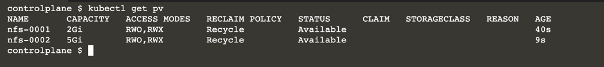
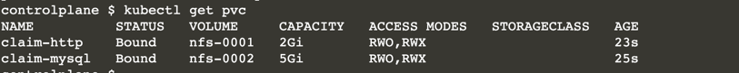

# Running Stateful Services on Kubernetes

## Step 1 - Deploy NFS Server

NFS is a protocol that allows nodes to read/write data over a network.

The protocol works by having a master node running the NFS daemon and stores the data.

This master node makes certain directories available over the network.

Clients access the masters shared via drive mounts.

From the viewpoint of applications, they are writing to the local disk. Under the covers, the NFS protocol writes it to the master.

## Task

for demonstration and learning purposes, the role of the NFS Server is handled by a customised container. The container makes directories available via NFS and stores the data inside the container. In production, it is recommended to configure a dedicated NFS Server.

Start the NFS using the command

```
docker run -d --net=host \
   --privileged --name nfs-server \
   katacoda/contained-nfs-server:centos7 \
   /exports/data-0001 /exports/data-0002
```

The NFS server exposes two directories, data-0001 and data-0002


## Step 2 - Deploy Persistent Volume

For Kubernetes to understand the available NFS shares, it requires a PersistentVolume configuration.

The PersistentVolume supports different protocols for storing data, such as AWS EBS volumes, GCE storage, OpenStack Cinder, Glusterfs and NFS. 

The configuration provides an abstraction between storage and API allowing for a consistent experience.

In the case of NFS, one PersistentVolume relates to one NFS directory

When a container has finished with the volume, the data can either be Retained for future use or the volume can be Recycled meaning all the data is deleted. The policy is defined by the persistentVolumeReclaimPolicy option.

```
apiVersion: v1
kind: PersistentVolume
metadata:
  name: nfs-0001
spec:
  capacity:
    storage: 2Gi
  accessModes:
    - ReadWriteOnce
    - ReadWriteMany
  persistentVolumeReclaimPolicy: Recycle
  nfs:
    server: 172.17.0.24 -- node ip (kubectl get nodes -o wide)
    path: /exports/data-0001
    
apiVersion: v1
kind: PersistentVolume
metadata:
  name: nfs-0002
spec:
  capacity:
    storage: 5Gi
  accessModes:
    - ReadWriteOnce
    - ReadWriteMany
  persistentVolumeReclaimPolicy: Recycle
  nfs:
    server: 172.17.0.24
    path: /exports/data-0002
```

```
 kubectl get pv
```



## Step 3 - Deploy Persistent Volume Claim

Once a Persistent Volume is available, applications can claim the volume for their use. 

The claim is designed to stop applications accidentally writing to the same volume and causing conflicts and data corruption

The claim specifies the requirements for a volume. This includes read/write access and storage space required.

```
kind: PersistentVolumeClaim
apiVersion: v1
metadata:
  name: claim-mysql
spec:
  accessModes:
    - ReadWriteOnce
  resources:
    requests:
      storage: 3Gi
```

### Task

Create two claims for two different applications. A MySQL Pod will use one claim, the other used by an HTTP server.

```
pvc-mysql.yaml
kind: PersistentVolumeClaim
apiVersion: v1
metadata:
  name: claim-mysql
spec:
  accessModes:
    - ReadWriteOnce
  resources:
    requests:
      storage: 3Gi
```

```
pvc-http.yaml
kind: PersistentVolumeClaim
apiVersion: v1
metadata:
  name: claim-http
spec:
  accessModes:
    - ReadWriteOnce
  resources:
    requests:
      storage: 1Gi
```



## Step 4 - Use Volume

When a deployment is defined, it can assign itself to a previous claim. 

The following snippet defines a volume mount for the directory /var/lib/mysql/data which is mapped to the storage mysql-persistent-storage. 

The storage called mysql-persistent-storage is mapped to the claim called claim-mysql.

```
  spec:
      volumeMounts:
        - name: mysql-persistent-storage
          mountPath: /var/lib/mysql/data
  volumes:
    - name: mysql-persistent-storage
      persistentVolumeClaim:
        claimName: claim-mysql
```

### Task

Launch two new Pods with Persistent Volume Claims.

Volumes are mapped to the correct directory when the Pods start allowing applications to read/write as if it was a local directory.

```
pod.mysql.yaml
apiVersion: v1
kind: Pod
metadata:
  name: mysql
  labels:
    name: mysql
spec:
  containers:
  - name: mysql
    image: openshift/mysql-55-centos7
    env:
      - name: MYSQL_ROOT_PASSWORD
        value: yourpassword
      - name: MYSQL_USER
        value: wp_user
      - name: MYSQL_PASSWORD
        value: wp_pass
      - name: MYSQL_DATABASE
        value: wp_db
    ports:
      - containerPort: 3306
        name: mysql
    volumeMounts:
      - name: mysql-persistent-storage
        mountPath: /var/lib/mysql/data
  volumes:
    - name: mysql-persistent-storage
      persistentVolumeClaim:
        claimName: claim-mysql
```

```
apiVersion: v1
kind: Pod
metadata:
  name: www
  labels:
    name: www
spec:
  containers:
  - name: www
    image: nginx:alpine
    ports:
      - containerPort: 80
        name: www
    volumeMounts:
      - name: www-persistent-storage
        mountPath: /usr/share/nginx/html
  volumes:
    - name: www-persistent-storage
      persistentVolumeClaim:
        claimName: claim-http
```

```
kubectl get pods
```

If a Persistent Volume Claim is not assigned to a Persistent Volume, then the Pod will be in Pending mode until it becomes available.

## Step 5 - Read/Write Data

Our Pods can now read/write. 

MySQL will store all database changes to the NFS Server while the HTTP Server will serve static from the NFS drive. 

When upgrading, restarting or moving containers to a different machine the data will still be accessible.

To test the HTTP server, write a 'Hello World' index.html homepage. 

In this scenario, we know the HTTP directory will be based on data-0001 as the volume definition hasn't driven enough space to satisfy the MySQL size requirement.

```
docker exec -it nfs-server bash -c "echo 'Hello World' > /exports/data-0001/index.html"
```

Based on the IP of the Pod, when accessing the Pod, it should return the expected response.

```
ip=$(kubectl get pod www -o yaml |grep podIP | awk '{split($0,a,":"); print a[2]}'); echo $ip
curl $ip
```

### Update Data

When the data on the NFS share changes, then the Pod will read the newly updated data.

```
docker exec -it nfs-server bash -c "echo 'Hello NFS World' > /exports/data-0001/index.html"
```

## Step 6 - Recreate Pod

Because a remote NFS server stores the data, if the Pod or the Host were to go down, then the data will still be available.

### Task
Deleting a Pod will cause it to remove claims to any persistent volumes. 

New Pods can pick up and re-use the NFS share.

```
kubectl delete pod www
kubectl create -f pod-www2.yaml
ip=$(kubectl get pod www2 -o yaml |grep podIP | awk '{split($0,a,":"); print a[2]}'); curl $ip
```

```
pod-www2.yaml
apiVersion: v1
kind: Pod
metadata:
  name: www2
  labels:
    name: www2
spec:
  containers:
  - name: www2
    image: nginx:alpine
    ports:
      - containerPort: 80
        name: www2
    volumeMounts:
      - name: www-persistent-storage
        mountPath: /usr/share/nginx/html
  volumes:
    - name: www-persistent-storage
      persistentVolumeClaim:
        claimName: claim-http
```

The applications now use a remote NFS for their data storage. Depending on requirements, this same approach works with other storage engines such as GlusterFS, AWS EBS, GCE storage or OpenStack Cinder.